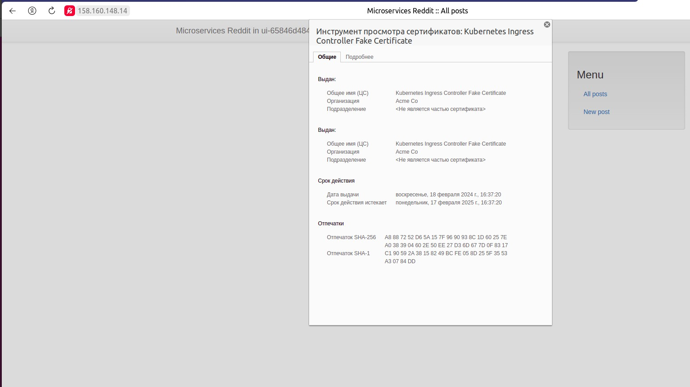
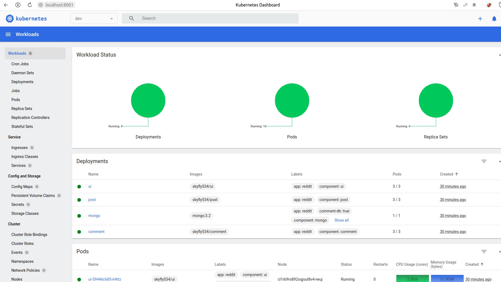
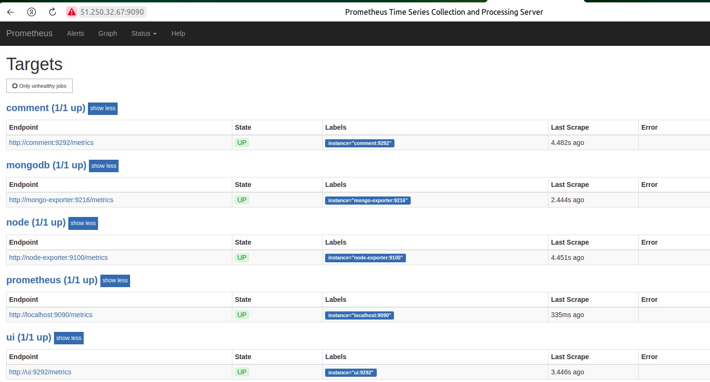
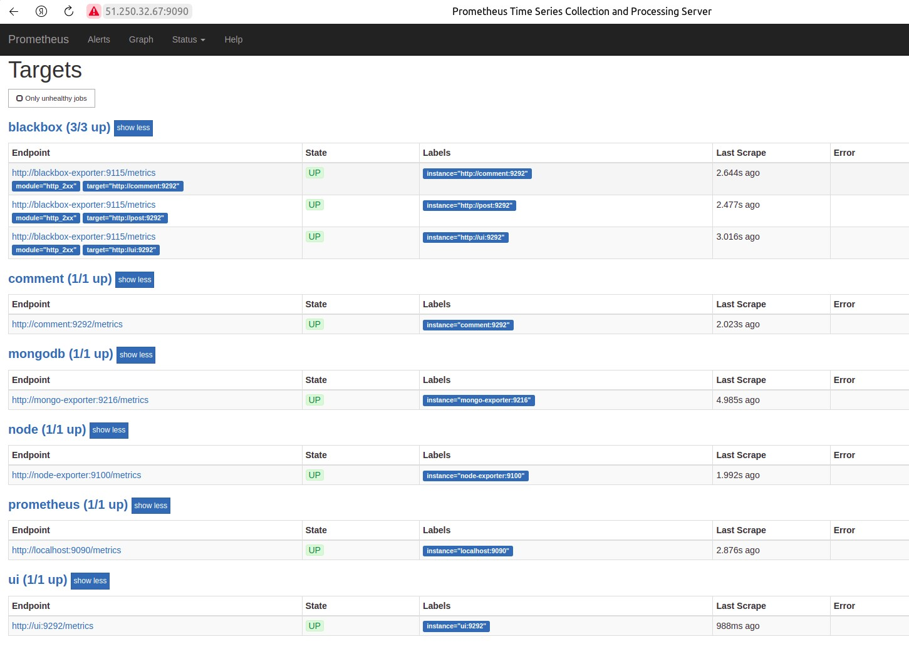

# Практические занятия:

## skyfly535_microservices
skyfly535 microservices repository

Оглавление:

- [HW12 Технология контейнеризации. Введение в Docker](#hw12-технология-контейнеризации-введение-в-docker)

- [HW13 Docker-образы. Микросервисы](#hw13-docker-образы-микросервисы)

- [HW14 Docker: сети, docker-compose](#hw14-docker-сети-docker-compose)

- [HW15 Устройство Gitlab CI. Построение процесса непрерывной поставки](#hw15-устройство-gitlab-ci-построение-процесса-непрерывной-поставки)

- [HW16 Введение в мониторинг. Системы мониторинга](#hw16-введение-в-мониторинг-системы-мониторинга)

- [HW17 Введение в kubernetes](#hw17-введение-в-kubernetes)

- [HW18 Kubernetes. Запуск кластера и приложения. Модель безопасности](#hw18-kubernetes-запуск-кластера-и-приложения-модель-безопасности)

- [HW19 Kubernetes. Networks, Storages](#hw19-kubernetes-networks-storages)

- [HW20 CI/CD в Kubernetes](#hw20-cicd-в-kubernetes)

- [HW21 Применение системы логирования в инфраструктуре на основе Docker](#hw21-применение-системы-логирования-в-инфраструктуре-на-основе-docker)

# HW21 Применение системы логирования в инфраструктуре на основе Docker (должок).

## В процессе выполнения ДЗ выполнены следующие мероприятия:

1. В YC cоздан хост и инициализировано окружение `Docker` на нем `docker-machine create`;

```
$ yc compute instance create \
>   --name worker \
>   --zone ru-central1-a \
>   --network-interface subnet-name=netterraform-ru-central1-a,nat-ip-version=ipv4 \
>   --create-boot-disk image-folder-id=standard-images,image-family=ubuntu-1804-lts,size=15 \
>   --memory 8 --cores 4 --core-fraction 100 \
>   --ssh-key ~/.ssh/ubuntu.pub
done (31s)

$ docker-machine create \
>   --driver generic \
>   --generic-ip-address=51.250.88.176 \
>   --generic-ssh-user yc-user \
>   --generic-ssh-key ~/.ssh/ubuntu  \
>   docker-host
Running pre-create checks...
...
Docker is up and running!
To see how to connect your Docker Client to the Docker Engine running on this virtual machine, run: docker-machine env docker-host

eval $(docker-machine env docker-host)
```
2. Подготовлено окружение. Скачана новая ветка reddit. Скопированы файлы в каталог приложения `./src.`;

```
git clone https://github.com/express42/reddit.git
```
3. Выполнена сборка образов ui, post, comment с тэгами `logging`;

```
$ export USER_NAME=skyfly534

/src$ cd ui && bash docker_build.sh && docker push $USER_NAME/ui

...

$ cd ../post-py && bash docker_build.sh && docker push $USER_NAME/post
...

$ cd ../comment && bash docker_build.sh && docker push $USER_NAME/comment
...

$ docker images
REPOSITORY          TAG       IMAGE ID       CREATED          SIZE
skyfly534/comment   logging   5c0952de5afb   9 minutes ago    89.1MB
skyfly534/post      logging   822d0f5d8e8c   11 minutes ago   210MB
skyfly534/ui        logging   dd98a7f398ae   14 minutes ago   188MB
```
4. Создан файл `docker-compose-logginig.yml` для системы логирования стек `EFK` ElasticSearch + Fluentd + Kibana;

./docker/docker-compose-logging.yml

```
version: '3'
services:
  fluentd:
    image: ${USERNAME}/fluentd
    ports:
      - "24224:24224"
      - "24224:24224/udp"

  elasticsearch:
    image: elasticsearch:7.4.0
    environment:
      - ELASTIC_CLUSTER=false
      - CLUSTER_NODE_MASTER=true
      - CLUSTER_MASTER_NODE_NAME=es01
      - discovery.type=single-node
    expose:
      - 9200
    ports:
      - "9200:9200"

  kibana:
    image: kibana:7.4.0
    ports:
      - "5601:5601"
```
5. Для запуска `Fluentd` созданы файлы Dockerfile и конфигурации для Fluentd, выполнена сборка образа;

./logging/fluentd/Dockerfile

```
FROM fluent/fluentd:v1.14.0-1.0
USER root
RUN gem uninstall -I elasticsearch && gem install elasticsearch -v 7.17.1
RUN gem install fluent-plugin-elasticsearch --no-document --version 5.2.3
RUN gem install fluent-plugin-grok-parser --no-document --version 2.6.2
USER fluent
ADD fluent.conf /fluentd/etc
```
./logging/fluentd/fluent.conf

```
<source>
  @type forward
  port 24224
  bind 0.0.0.0
</source>

<match *.**>
  @type copy
  <store>
    @type elasticsearch
    host elasticsearch
    port 9200
    logstash_format true
    logstash_prefix fluentd
    logstash_dateformat %Y%m%d
    include_tag_key true
    type_name access_log
    tag_key @log_name
    flush_interval 1s
  </store>
  <store>
    @type stdout
  </store>
</match>
```
Билдим образ

```
./logging/fluentd$ docker build -t skyfly534/fluentd .
[+] Building 234.5s (11/11) FINISHED
 => [internal] load build definition from Dockerfile

...

=> => naming to docker.io/skyfly534/fluentd

$ docker images
REPOSITORY          TAG       IMAGE ID       CREATED          SIZE
skyfly534/fluentd   latest    ea25c7dd2003   16 seconds ago   124MB
skyfly534/comment   logging   5c0952de5afb   23 minutes ago   89.1MB
skyfly534/post      logging   822d0f5d8e8c   26 minutes ago   210MB
skyfly534/ui        logging   dd98a7f398ae   28 minutes ago   188MB
```
6. Откорректирован файл `docker-compose.yml` и поднят тестовый сайт;

```
--- a/docker/docker-compose.yml
+++ b/docker/docker-compose.yml
services:
       - back_net

   ui:
-    image: ${USERNAME}/ui:latest
+    image: ${USERNAME}/ui:logging
     ports:
       - ${UI_PORT}:9292/tcp
     networks:
       - front_net

   post:
-    image: ${USERNAME}/post:latest
+    image: ${USERNAME}/post:logging
     networks:
       - back_net
       - front_net

   comment:
-    image: ${USERNAME}/comment:latest
+    image: ${USERNAME}/comment:logging
     networks:
       - back_net
       - front_net
-  prometheus:
-    image: ${USERNAME}/prometheus:latest
-    ports:
-      - '9090:9090'
-    volumes:
-      - prometheus_data:/prometheus
-    command:
-      - '--config.file=/etc/prometheus/prometheus.yml'
-      - '--storage.tsdb.path=/prometheus'
-      - '--storage.tsdb.retention=1d'
-    networks:
-      - front_net
-      - back_net
-
-  node-exporter:
-    image: prom/node-exporter:v0.15.2
-    user: root
-    volumes:
-      - /proc:/host/proc:ro
-      - /sys:/host/sys:ro
-      - /:/rootfs:ro
-    command:
-      - '--path.procfs=/host/proc'
-      - '--path.sysfs=/host/sys'
-      - '--collector.filesystem.ignored-mount-points="^/(sys|proc|dev|host|etc)($$|/)"'
-    networks:
-      - front_net
-      - back_net
-
-  mongo-exporter:
-    image: percona/mongodb_exporter:0.35
-    command:
-      - '--mongodb.uri=mongodb://post_db:27017'
-      - '--collect-all'
-      - '--log.level=debug'
-    ports:
-      - '9216:9216'
-    networks:
-      - back_net
-
-  blackbox-exporter:
-    image: r2d2k/blackbox-exporter:1.0
-    ports:
-      - '9115:9115'
-    networks:
-      - front_net
-
 volumes:
   post_db:
-  prometheus_data:

 networks:
   front_net:
```

Настроим драйвер логирования для сервиса `post`

```
--- a/docker/docker-compose.yml
+++ b/docker/docker-compose.yml
services:
     networks:
       - back_net
       - front_net
+    logging:
+      driver: "fluentd"
+      options:
+        fluentd-address: localhost:24224
+        tag: service.post

   comment:
     image: ${USERNAME}/comment:logging
```

Запускаем сайт и EFK стек

```
./docker$ docker compose -f docker-compose-logging.yml up -d

./docker$ docker compose up -d

$ docker compose ps
NAME                        IMAGE                       COMMAND                  SERVICE             CREATED             STATUS              PORTS
skyfly534-comment-1         skyfly534/comment:logging   "puma"                   comment             5 minutes ago       Up 5 minutes
skyfly534-elasticsearch-1   elasticsearch:7.4.0         "/usr/local/bin/dock…"   elasticsearch       6 minutes ago       Up 6 minutes        0.0.0.0:9200->9200/tcp, :::9200->9200/tcp, 9300/tcp
skyfly534-fluentd-1         skyfly534/fluentd           "tini -- /bin/entryp…"   fluentd             6 minutes ago       Up 6 minutes        5140/tcp, 0.0.0.0:24224->24224/tcp, 0.0.0.0:24224->24224/udp, :::24224->24224/tcp, :::24224->24224/udp
skyfly534-kibana-1          kibana:7.4.0                "/usr/local/bin/dumb…"   kibana              6 minutes ago       Up 6 minutes        0.0.0.0:5601->5601/tcp, :::5601->5601/tcp
skyfly534-mongo_db-1        mongo:3.2                   "docker-entrypoint.s…"   mongo_db            5 minutes ago       Up 5 minutes        27017/tcp
skyfly534-post-1            skyfly534/post:logging      "python3 post_app.py"    post                5 minutes ago       Up 5 minutes
skyfly534-ui-1              skyfly534/ui:logging        "puma"                   ui                  5 minutes ago       Up 5 minutes        0.0.0.0:80->9292/tcp, :::80->9292/tcp
```

7. Изучен сбор структурированных и неструктурированных логов сервисов `post` и `ui`;

Видим, что `elasticsearch` и `kibana` поднялись и отвечают на запросы. Создадим несколько постов и проверим, что видно в kibana.

Для разбора строки на поля, для этого берем фильры `fluentd`.
```
{"addr": "10.0.1.3", "event": "request", "level": "info", "method": "GET", "path": "/healthcheck?", "request_id": null, "response_status": 200, "service": "post", "timestamp": "2024-03-02 12:17:41"}
```

```
<filter service.post>
  @type parser
  format json
  key_name log
</filter>
```

Для разбора неструктурированных логов сервиса `ui` добавим к контейнеру драйвер для логирования:

```
--- a/docker/docker-compose.yml
+++ b/docker/docker-compose.yml
services:
       - ${UI_PORT}:9292/tcp
     networks:
       - front_net
    logging:
      driver: "fluentd"
      options:
        fluentd-address: localhost:24224
        tag: service.ui

   post:
     image: ${USERNAME}/post:logging
```
логи сервиса ui

```
{"addr": "10.0.1.3", "event": "request", "level": "info", "method": "GET", "path": "/healthcheck?", "request_id": null, "response_status": 200, "service": "post", "timestamp": "2024-03-02 12:30:17"}
```
Разбираем при помощи регулярного выражения. Редактируем файл `fluent.conf`.

```
<filter service.ui>
  @type parser
  format /\[(?<time>[^\]]*)\]  (?<level>\S+) (?<user>\S+)[\W]*service=(?<service>\S+)[\W]*event=(?<event>\S+)[\W]*(?:path=(?<path>\S+)[\W]*)?request_id=(?<request_id>\S+)[\W]*(?:remote_addr=(?<remote_addr>\S+)[\W]*)?(?:method= (?<method>\S+)[\W]*)?(?:response_status=(?<response_status>\S+)[\W]*)?(?:message='(?<message>[^\']*)[\W]*)?/
  key_name log
</filter>
```
Чтобы уйти от огорода регулярок в этом случае можно использовать `grok` шаблоны.

```
<filter service.ui>
  @type parser
  <parse>
    @type grok
    <grok>
      pattern %{RUBY_LOGGER}
    </grok>
  </parse>
  key_name log
</filter>
```

8. Разобраны остальные неструктурированные логи;

Используем два последовательных фильтра для разбора на составные части сообщений сервиса `ui`.

```
<filter service.ui>
  @type parser
  <parse>
    @type grok
    <grok>
      pattern service=%{WORD:service} \| event=%{WORD:event} \| request_id=%{GREEDYDATA:request_id} \| message='%{GREEDYDATA:message}'
    </grok>
  </parse>
  key_name message
  reserve_data true
</filter>

<filter service.ui>
  @type parser
  <parse>
    @type grok
    <grok>
      pattern service=%{WORD:service} \| event=%{WORD:event} \| path=%{GREEDYDATA:path} \| request_id=%{GREEDYDATA:request_id} \| remote_addr=%{IPV4:remote_addr} \| method= %{WORD:method} \| response_status=%{INT:response_status}
    </grok>
  </parse>
  key_name message
</filter>
```
Для упращения жизни логично использовать онлайн дебаггеров grok. [Один из них.](https://www.heroku.com/home)

9. Настроен распределенный трейсинг;

В compose-файл для сервисов логирования добавлен сервис распределенного трейсинга `Zipkin`

```
--- a/docker/docker-compose-logging.yml
+++ b/docker/docker-compose-logging.yml
services:
     image: kibana:7.4.0
     ports:
       - "5601:5601"

  zipkin:
    image: openzipkin/zipkin:2.21.0
    ports:
      - "9411:9411"
```
Сервисы настроены на использование Zipkin

```
--- a/docker/docker-compose.yml
+++ b/docker/docker-compose.yml
services:
       options:
         fluentd-address: localhost:24224
         tag: service.ui
    environment:
      - ZIPKIN_ENABLED=${ZIPKIN_ENABLED}

   post:
     image: ${USERNAME}/post:logging
services:
       options:
         fluentd-address: localhost:24224
         tag: service.post
    environment:
      - ZIPKIN_ENABLED=${ZIPKIN_ENABLED}

   comment:
     image: ${USERNAME}/comment:logging
     networks:
       - back_net
       - front_net
    environment:
      - ZIPKIN_ENABLED=${ZIPKIN_ENABLED}

 volumes:
   post_db:

...

image: openzipkin/zipkin:2.21.0
     ports:
       - "9411:9411"
    networks:
      - front_net
      - back_net

networks:
  front_net:
    driver: bridge
    ipam:
      config:
        - subnet: 10.0.1.0/24

  back_net:
    driver: bridge
    ipam:
     config:
        - subnet: 10.0.2.0/24
```
Изучен функционал трейсов через web-интерфейс Zipkin.

## Дополнительное задание.

10. Произведен траблшутинг UI-экспириенса.
Загружен репозиторий со сломанным кодом приложения в каталог src-bugged и запущен.

В `zipkin` видим, что функция `db_find_single_post` сервиса `post` отрабатывает 3 секунды. Находим в исходнике, исправляем.

```
./bugged-code/post-py/post_app.py

def find_post(id):
         stop_time = time.time()  # + 0.3
         resp_time = stop_time - start_time
         app.post_read_db_seconds.observe(resp_time)
         time.sleep(3) <--------------------------------------- Баг тут!
         log_event('info', 'post_find',
                   'Successfully found the post information',
                   {'post_id': id})
```

# HW20 CI/CD в Kubernetes.

## В процессе выполнения ДЗ выполнены следующие мероприятия:

1. Установлен `Helm`, развернута необходимая инфраструктура для работы с ним;

```
$ sudo snap install helm --classic

helm 3.14.1 от Snapcrafters✪ установлен
```
Helm читает конфигурацию kubectl ~/.kube/config и сам определяет текущий контекст (кластер, пользователь, неймспейс).

`Chart` - это пакет в Helm. Создан подкаталог Charts в каталоге kubernetes со следующей структурой:

```
$ mkdir -p kubernetes/Charts/{comment,post,reddit,ui}

$ tree kubernetes/Charts/
kubernetes/Charts/
├── comment
├── post
├── reddit
└── ui
```
Создан файл-описание чарта для компонента `ui`, сохранен в ./kubernetes/Charts/ui/Chart.yaml

```
name: ui
version: 1.0.0
description: OTUS reddit application UI
maintainers:
  - name: me
    email: me@me.me
appVersion: 1.0
```
Перенесены в каталог ./kubernetes/Charts/ui и переименованы все манифесты для сервиса ui, подготовленные при выполнении предыдущего ДЗ

```
./kubernetes/Charts$ tree
.
├── comment
├── post
├── reddit
└── ui
    ├── Chart.yaml
    └── templates
        ├── deployment.yaml
        ├── ingress.yaml
        └── service.yaml
```
2. Установлен и зарегистрирован локально кластер `Kubernetes`в `Yandex Cloud`;

```
./kubernetes/terraform_YC_k8s$ terraform apply -auto-approve

$ yc managed-kubernetes cluster get-credentials skyfly535 --external

Context 'yc-skyfly535' was added as default to kubeconfig '/home/roman/.kube/config'.
Check connection to cluster using 'kubectl cluster-info --kubeconfig /home/roman/.kube/config'.

Note, that authentication depends on 'yc' and its config profile 'terraform-profile'.
To access clusters using the Kubernetes API, please use Kubernetes Service Account.
```
3. Запущен тестовый сервис `ui` при помощи helm;
```
$ helm install test-ui-1 ui/
NAME: test-ui-1
LAST DEPLOYED: Mon Feb 19 20:50:00 2024
NAMESPACE: default
STATUS: deployed
REVISION: 1
TEST SUITE: None

$ helm ls
NAME     	NAMESPACE	REVISION	UPDATED                                	STATUS  	CHART   	APP VERSION
test-ui-1	default  	1       	2024-02-19 20:50:00.115670654 +1000 +10	deployed	ui-1.0.0	1

$ kubectl get deployments
NAME   READY   UP-TO-DATE   AVAILABLE   AGE
ui     3/3     3            3           34s

$ kubectl get pods
NAME                  READY   STATUS    RESTARTS   AGE
ui-65846d4847-kpf26   1/1     Running   0          47s
ui-65846d4847-rprv5   1/1     Running   0          47s
ui-65846d4847-td2d9   1/1     Running   0          47s
```
4. Шаблонизирован `Chart ui` для запуска несколько релизов одновременно;

```

--- a/kubernetes/Charts/ui/templates/deployment.yaml
+++ b/kubernetes/Charts/ui/templates/deployment.yaml
 apiVersion: apps/v1
 kind: Deployment       # Deploy metadata
 metadata:
-  name: ui
+  name: {{ .Release.Name }}-{{ .Chart.Name }}
   labels:
     app: reddit
     component: ui
+    release: {{ .Release.Name }}
 spec:                  # Deploy specification
   replicas: 3
   selector:
     matchLabels:
       app: reddit
       component: ui
+      release: {{ .Release.Name }}
   template:            # Pod description
     metadata:
       name: ui-pod
       labels:
         app: reddit
         component: ui
+        release: {{ .Release.Name }}
     spec:
       containers:
       - image: skyfly534/ui


--- a/kubernetes/Charts/ui/templates/ingress.yaml
+++ b/kubernetes/Charts/ui/templates/ingress.yaml
 apiVersion: networking.k8s.io/v1
 kind: Ingress
 metadata:
-  name: ui
+  name: {{ .Release.Name }}-{{ .Chart.Name }}
   annotations:
     nginx.ingress.kubernetes.io/force-ssl-redirect: "true"
 spec:
spec:
         pathType: Prefix
         backend:
           service:
-            name: ui
+            name: {{ .Release.Name }}-{{ .Chart.Name }}
             port:
               number: 9292


--- a/kubernetes/Charts/ui/templates/service.yaml
+++ b/kubernetes/Charts/ui/templates/service.yaml
 apiVersion: v1
 kind: Service
 metadata:
-  name: ui
+  name: {{ .Release.Name }}-{{ .Chart.Name }}
   labels:
     app: reddit
     component: ui
+    release: {{ .Release.Name }}
 spec:
   type: LoadBalancer
   ports:
spec:
   selector:
     app: reddit
     component: ui
+    release: {{ .Release.Name }}
```
Определены значения переменных в ./kubernetes/Charts.ui/values.yaml

```
service:
  internalPort: 9292
  externalPort: 9292
image:
  repository: skyfly534/ui
  tag: latest
```
Добавлено еще два релиза сервиса

```
$ helm install test-ui-2 ui/
NAME: test-ui-2
LAST DEPLOYED: Mon Feb 19 22:04:20 2024
NAMESPACE: default
STATUS: deployed
REVISION: 1
TEST SUITE: None

$ helm install test-ui-3 ui/
NAME: test-ui-3
LAST DEPLOYED: Mon Feb 19 22:04:33 2024
NAMESPACE: default
STATUS: deployed
REVISION: 1
TEST SUITE: None

$ kubectl get ingress
NAME           CLASS   HOSTS   ADDRESS   PORTS     AGE
test-ui-2-ui   nginx   *                 80, 443   30s
test-ui-3-ui   nginx   *                 80, 443   16s
ui             nginx   *                 80, 443   74m
```

Внешнего IP нет, проверяем балансировщики

```
$ yc lb nlb list
+----------------------+----------------------------------------------+-------------+----------+----------------+------------------------+--------+
|          ID          |                     NAME                     |  REGION ID  |   TYPE   | LISTENER COUNT | ATTACHED TARGET GROUPS | STATUS |
+----------------------+----------------------------------------------+-------------+----------+----------------+------------------------+--------+
| enpao0gffvjsdbso9d1e | k8s-31668eef5732782c429805d08727ff0e18e271ec | ru-central1 | EXTERNAL |              1 | enpcs57cebvnhj256t1b   | ACTIVE |
| enpgorbphvl5amfutsit | k8s-7283e9558a0d7ea97ad1bc8b02d4b6d1b24ea0a4 | ru-central1 | EXTERNAL |              1 | enpcs57cebvnhj256t1b   | ACTIVE |
+----------------------+----------------------------------------------+-------------+----------+----------------+------------------------+--------+

$ yc lb nlb get enpao0gffvjsdbso9d1e
id: enpao0gffvjsdbso9d1e
folder_id: b1ghhcttrug793gc11tt
created_at: "2024-02-19T12:04:21Z"
name: k8s-31668eef5732782c429805d08727ff0e18e271ec
description: cluster catv7gl39njseu9k53ir, service default/test-ui-2-ui
labels:
  cluster-name: catv7gl39njseu9k53ir
  service-name: test-ui-2-ui
  service-namespace: default
  service-uid: 97390da5-c529-4f87-87fc-05929297db2b
region_id: ru-central1
status: ACTIVE
type: EXTERNAL
listeners:
  - name: default
    address: 158.160.149.197
    port: "9292"
    protocol: TCP
    target_port: "30932"
    ip_version: IPV4
attached_target_groups:
  - target_group_id: enpcs57cebvnhj256t1b
    health_checks:
      - name: default
        interval: 10s
        timeout: 5s
        unhealthy_threshold: "2"
        healthy_threshold: "2"
        http_options:
          port: "10256"
          path: /healthz

$ yc lb nlb get enpgorbphvl5amfutsit
id: enpgorbphvl5amfutsit
folder_id: b1ghhcttrug793gc11tt
created_at: "2024-02-19T12:52:14Z"
name: k8s-7283e9558a0d7ea97ad1bc8b02d4b6d1b24ea0a4
description: cluster catv7gl39njseu9k53ir, service default/test-ui-1-ui
labels:
  cluster-name: catv7gl39njseu9k53ir
  service-name: test-ui-1-ui
  service-namespace: default
  service-uid: 2bb71ff7-d0b3-4af9-b80e-bc19e5a8ee73
region_id: ru-central1
status: ACTIVE
type: EXTERNAL
listeners:
  - name: default
    address: 158.160.147.233
    port: "9292"
    protocol: TCP
    target_port: "31171"
    ip_version: IPV4
attached_target_groups:
  - target_group_id: enpcs57cebvnhj256t1b
    health_checks:
      - name: default
        interval: 10s
        timeout: 5s
        unhealthy_threshold: "2"
        healthy_threshold: "2"
        http_options:
          port: "10256"
          path: /healthz
```
Балансировщика два, так как достигнут предел квоты `ylb.networkLoadBalancers.count`.

Но сервис по IP адресам из вывода состояния балансировщиков отвечает.

Проапргрейжены сервисы, теперь уже с объявленными переменными. Сервис отвечает с теми же IP, но по порту 9292.

```
$ helm upgrade test-ui-1 ui/

$ helm upgrade test-ui-2 ui/
```
Структура следующая

```
$ tree
.
├── comment
├── post
├── reddit
└── ui
    ├── Chart.yaml
    ├── templates
    │   ├── deployment.yaml
    │   ├── ingress.yaml
    │   └── service.yaml
    └── values.yaml
```
5. Подготовлены по предыдущему образцу чарты для остальных сервисов;

```
$ tree
.
├── comment
│   ├── Chart.yaml
│   ├── templates
│   │   ├── deployment.yaml
│   │   ├── _helpers.tpl
│   │   └── service.yaml
│   └── values.yaml
├── post
│   ├── Chart.yaml
│   ├── templates
│   │   ├── deployment.yaml
│   │   ├── _helpers.tpl
│   │   └── service.yaml
│   └── values.yaml
├── reddit
│   ├── Chart.yaml
│   ├── requirements.yaml
│   └── values.yaml
└── ui
    ├── Chart.yaml
    ├── templates
    │   ├── deployment.yaml
    │   ├── _helpers.tpl
    │   ├── ingress.yaml
    │   └── service.yaml
    └── values.yaml
```

В каждую папку с шаблонами добавлен `_helpers.tpl`

```
{{- define "ui.fullname" -}}
{{- printf "%s-%s" .Release.Name .Chart.Name }}
{{- end -}}
```

Все ссылки на имена заменены функцией `{{ template "comment.fullname" . }}`.

Для запуска приложения целиком создан общий чарт в каталоге `reddit`(файл `requirements.yaml`)

```
dependencies:
  - name: ui
    version: "1.0.0"
    repository: "file://../ui"

  - name: post
    version: "1.0.0"
    repository: "file://../post"

  - name: comment
    version: "1.0.0"
    repository: "file://../comment"
```
Chart.yaml

```
name: reddit
version: 0.1.0
description: OTUS reddit application
maintainers:
  - name: me
    email: me@me.me
appVersion: 1.0
```

Проверяем. Загружаем зависимости.

```
$ helm dep update
Saving 3 charts
Deleting outdated charts

$ tree
.
├── charts
│   ├── comment-1.0.0.tgz
│   ├── post-1.0.0.tgz
│   └── ui-1.0.0.tgz
├── Chart.yaml
├── requirements.lock
├── requirements.yaml
└── values.yaml
```

6. Установлен сервис `mongodb` при помощи чарта;

```
$ helm repo list
Error: no repositories to show

$ helm repo add google https://kubernetes-charts.storage.googleapis.com
Error: repo "https://kubernetes-charts.storage.googleapis.com" is no longer available; try "https://charts.helm.sh/stable" instead

$ helm repo add google https://charts.helm.sh/stable
"google" has been added to your repositories

$ helm repo add bitnami https://charts.bitnami.com/bitnami
"bitnami" has been added to your repositories

$ helm search repo mongo
NAME                              	CHART VERSION	APP VERSION	DESCRIPTION
bitnami/mongodb                   	14.10.1      	7.0.5      	MongoDB(R) is a relational open source NoSQL da...
bitnami/mongodb-sharded           	7.6.0        	7.0.5      	MongoDB(R) is an open source NoSQL database tha...
google/mongodb                    	7.8.10       	4.2.4      	DEPRECATED NoSQL document-oriented database tha...
google/mongodb-replicaset         	3.17.2       	3.6        	DEPRECATED - NoSQL document-oriented database t...
google/prometheus-mongodb-exporter	2.8.1        	v0.10.0    	DEPRECATED A Prometheus exporter for MongoDB me...
google/unifi                      	0.10.2       	5.12.35    	DEPRECATED - Ubiquiti Network's Unifi Controller
```
Установка из готового чата не удалась, поэтому был подсмотрен и адаптирован чат для БД `./kubernetes/Charts/mongodb`.

Дописана секция в файл `./kubernetes/Charts/reddit/requirements.yaml` общего чата

```
- name: mongodb
    version: "1.0.0"
    repository: "file://../mongodb"
```
Проверяем

```
$ helm dep update
Hang tight while we grab the latest from your chart repositories...
...Successfully got an update from the "google" chart repository
...Successfully got an update from the "bitnami" chart repository
Update Complete. ⎈Happy Helming!⎈
Saving 4 charts
Deleting outdated charts

$ helm upgrade reddit-test reddit/
Release "reddit-test" has been upgraded. Happy Helming!
NAME: reddit-test
LAST DEPLOYED: Wed Feb 21 18:28:12 2024
NAMESPACE: default
STATUS: deployed
REVISION: 2
TEST SUITE: None

$ kubectl get pods
NAME                                   READY   STATUS    RESTARTS   AGE
reddit-test-comment-5557c576fd-bp5jk   1/1     Running   0          21s
reddit-test-mongodb-565577c7cb-ttw9t   1/1     Running   0          48m
reddit-test-post-7fdfcdf4f7-rf794      1/1     Running   0          48m
reddit-test-ui-5cbbbcd5c9-bhsqw        1/1     Running   0          48m
reddit-test-ui-5cbbbcd5c9-hmbrm        1/1     Running   0          48m
reddit-test-ui-5cbbbcd5c9-hx9hs        1/1     Running   0          48m
```

7. Указаны переменные окружения для поиска хостов (связи сервисов в кластере);

```
--- a/kubernetes/Charts/ui/templates/deployment.yaml
+++ b/kubernetes/Charts/ui/templates/deployment.yaml
spec:                        # Deploy specification
       - image: {{ .Values.image.repository }}:{{ .Values.image.tag }}
         name: ui
         ports:
-          - containerPort: {{ .Values.service.internalPort }}
+        - containerPort: {{ .Values.service.internalPort }}
+          name: ui
         env:
+        - name: POST_SERVICE_HOST
+          value: {{  .Values.postHost | default (printf "%s-post" .Release.Name) }}
+        - name: POST_SERVICE_PORT
+          value: {{  .Values.postPort | default "5000" | quote }}
+        - name: COMMENT_SERVICE_HOST
+          value: {{  .Values.commentHost | default (printf "%s-comment" .Release.Name) }}
+        - name: COMMENT_SERVICE_PORT
+          value: {{  .Values.commentPort | default "9292" | quote }}
         - name: ENV
           valueFrom:
             fieldRef:
-              fieldPath: metadata.namespace
+              fieldPath: metadata.namespace
```

Проверяем. Обновляем чаты и релизы.

```
$ helm dep update ./reddit
Hang tight while we grab the latest from your chart repositories...
...Successfully got an update from the "bitnami" chart repository
...Successfully got an update from the "google" chart repository
Update Complete. ⎈Happy Helming!⎈
Saving 4 charts
Deleting outdated charts

$ helm upgrade reddit-test reddit
Release "reddit-test" has been upgraded. Happy Helming!
NAME: reddit-test
LAST DEPLOYED: Wed Feb 21 18:46:25 2024
NAMESPACE: default
STATUS: deployed
REVISION: 3
TEST SUITE: None
```
Все роботает.

Для нормальной работы приложения не хватает `ingress-nginx`

```
$ kubectl apply -f https://raw.githubusercontent.com/kubernetes/ingress-nginx/controller-v1.8.2/deploy/static/provider/cloud/deploy.yaml
namespace/ingress-nginx created
serviceaccount/ingress-nginx created
serviceaccount/ingress-nginx-admission created
role.rbac.authorization.k8s.io/ingress-nginx created
role.rbac.authorization.k8s.io/ingress-nginx-admission created
clusterrole.rbac.authorization.k8s.io/ingress-nginx created
clusterrole.rbac.authorization.k8s.io/ingress-nginx-admission created
rolebinding.rbac.authorization.k8s.io/ingress-nginx created
rolebinding.rbac.authorization.k8s.io/ingress-nginx-admission created
clusterrolebinding.rbac.authorization.k8s.io/ingress-nginx created
clusterrolebinding.rbac.authorization.k8s.io/ingress-nginx-admission created
configmap/ingress-nginx-controller created
service/ingress-nginx-controller created
service/ingress-nginx-controller-admission created
deployment.apps/ingress-nginx-controller created
job.batch/ingress-nginx-admission-create created
job.batch/ingress-nginx-admission-patch created
ingressclass.networking.k8s.io/nginx created
validatingwebhookconfiguration.admissionregistration.k8s.io/ingress-nginx-admission created

$ kubectl get ingress reddit-test-ui
NAME             CLASS   HOSTS   ADDRESS           PORTS     AGE
reddit-test-ui   nginx   *       158.160.148.224   80, 443   76m
```

8. В kubernetes кластер при помощи `Helm Chart’а` разработчика установлен Gitlab;

```
$ helm repo remove bitnami
"bitnami" has been removed from your repositories

$ helm repo add gitlab https://charts.gitlab.io/
"gitlab" has been added to your repositories

$ helm repo update
Hang tight while we grab the latest from your chart repositories...
...Successfully got an update from the "gitlab" chart repository
...Successfully got an update from the "bitnami" chart repository
...Successfully got an update from the "google" chart repository
Update Complete. ⎈Happy Helming!⎈

$ helm pull gitlab/gitlab --untar
```
Редактируем файл `./kubernetes/Charts/gitlab/values.yaml`

```

--- a/kubernetes/Charts/gitlab/values.yaml
+++ b/kubernetes/Charts/gitlab/values.yaml
global:
     labels: {}

   ## https://docs.gitlab.com/charts/installation/deployment#deploy-the-community-edition
-  edition: ee
+  edition: ce

   ## https://docs.gitlab.com/charts/charts/globals#gitlab-version
   # gitlabVersion:

global:
       certName: "tls.crt"

   ## Timezone for containers.
-  time_zone: UTC
+  time_zone: Asia/Vladivostok

   ## Global Service Annotations and Labels
   service:

upgradeCheck:
   priorityClassName: ""

 ## Settings to for the Let's Encrypt ACME Issuer
-# certmanager-issuer:
+certmanager-issuer:
 #   # The email address to register certificates requested from Let's Encrypt.
 #   # Required if using Let's Encrypt.
-#   email: email@example.com
+  email: otus@mail.com

 ## Installation & configuration of jetstack/cert-manager
 ## See requirements.yaml for current version

nginx-ingress:
 ## Installation & configuration of stable/prometheus
 ## See requirements.yaml for current version
 prometheus:
-  install: true
+  install: false
   rbac:
     create: true
   alertmanager:
```

Производим установку [мануал](https://docs.gitlab.com/charts/installation/deployment.html)

```
$ helm install gitlab ./gitlab
NAME: gitlab
LAST DEPLOYED: Mon Feb 26 18:24:04 2024
NAMESPACE: default
STATUS: deployed
REVISION: 1
NOTES:
=== NOTICE
The minimum required version of PostgreSQL is now 12. See https://gitlab.com/gitlab-org/charts/gitlab/-/blob/master/doc/installation/upgrade.md for more details.

=== NOTICE
You've installed GitLab Runner without the ability to use 'docker in docker'.
The GitLab Runner chart (gitlab/gitlab-runner) is deployed without the `privileged` flag by default for security purposes. This can be changed by setting `gitlab-runner.runners.privileged` to `true`. Before doing so, please read the GitLab Runner chart's documentation on why we
chose not to enable this by default. See https://docs.gitlab.com/runner/install/kubernetes.html#running-docker-in-docker-containers-with-gitlab-runners
Help us improve the installation experience, let us know how we did with a 1 minute survey:https://gitlab.fra1.qualtrics.com/jfe/form/SV_6kVqZANThUQ1bZb?installation=helm&release=15-6

=== NOTICE
The in-chart NGINX Ingress Controller has the following requirements:
    - Kubernetes version must be 1.19 or newer.
    - Ingress objects must be in group/version `networking.k8s.io/v1`.

$ kubectl get ingress
NAME                        CLASS          HOSTS                  ADDRESS           PORTS     AGE
gitlab-kas                  gitlab-nginx   kas.example.com        158.160.131.134   80, 443   3m42s
gitlab-minio                gitlab-nginx   minio.example.com      158.160.131.134   80, 443   3m42s
gitlab-registry             gitlab-nginx   registry.example.com   158.160.131.134   80, 443   3m42s
gitlab-webservice-default   gitlab-nginx   gitlab.example.com     158.160.131.134   80, 443   3m42s
```

Еще раз редактируем файл `./kubernetes/Charts/gitlab/values.yaml`

```
--- a/kubernetes/Charts/gitlab/values.yaml
+++ b/kubernetes/Charts/gitlab/values.yaml
global:
     allowClusterRoles: true
   ## https://docs.gitlab.com/charts/charts/globals#configure-host-settings
   hosts:
-    domain: example.com
+    domain: 158.160.131.134.sslip.io
     hostSuffix:
     https: true
-    externalIP:
+    externalIP: 158.160.131.134
     ssh: ~
     gitlab: {}
     minio: {}
```

Апгрейдим

```
$ helm upgrade gitlab ./gitlab
Release "gitlab" has been upgraded. Happy Helming!
NAME: gitlab
LAST DEPLOYED: Mon Feb 26 18:33:08 2024
NAMESPACE: default
STATUS: deployed
REVISION: 2
NOTES:
=== NOTICE
The minimum required version of PostgreSQL is now 12. See https://gitlab.com/gitlab-org/charts/gitlab/-/blob/master/doc/installation/upgrade.md for more details.

=== NOTICE
You've installed GitLab Runner without the ability to use 'docker in docker'.
The GitLab Runner chart (gitlab/gitlab-runner) is deployed without the `privileged` flag by default for security purposes. This can be changed by setting `gitlab-runner.runners.privileged` to `true`. Before doing so, please read the GitLab Runner chart's documentation on why we
chose not to enable this by default. See https://docs.gitlab.com/runner/install/kubernetes.html#running-docker-in-docker-containers-with-gitlab-runners

=== NOTICE
The in-chart NGINX Ingress Controller has the following requirements:
    - Kubernetes version must be 1.19 or newer.
    - Ingress objects must be in group/version `networking.k8s.io/v1`.

$ kubectl get ingress
NAME                        CLASS          HOSTS                               ADDRESS           PORTS     AGE
gitlab-kas                  gitlab-nginx   kas.158.160.131.134.sslip.io        158.160.131.134   80, 443   10m
gitlab-minio                gitlab-nginx   minio.158.160.131.134.sslip.io      158.160.131.134   80, 443   10m
gitlab-registry             gitlab-nginx   registry.158.160.131.134.sslip.io   158.160.131.134   80, 443   10m
gitlab-webservice-default   gitlab-nginx   gitlab.158.160.131.134.sslip.io     158.160.131.134   80, 443   10m
```

Установлено параметру `gitlab-runner.runners.privileged` значение `true` для работы в режиме  `docker in docker`

```
$ helm upgrade gitlab ./gitlab --set gitlab-runner.runners.privileged=true
Release "gitlab" has been upgraded. Happy Helming!
NAME: gitlab
LAST DEPLOYED: Mon Feb 26 18:39:01 2024
NAMESPACE: default
STATUS: deployed
REVISION: 3
NOTES:
=== NOTICE
The minimum required version of PostgreSQL is now 12. See https://gitlab.com/gitlab-org/charts/gitlab/-/blob/master/doc/installation/upgrade.md for more details.

=== NOTICE
The in-chart NGINX Ingress Controller has the following requirements:
    - Kubernetes version must be 1.19 or newer.
    - Ingress objects must be in group/version `networking.k8s.io/v1`.
```
или

```
helm upgrade gitlab ./gitlab \
  --set global.hosts.domain=158.160.131.134.sslip.io \
  --set global.hosts.externalIP=158.160.131.134 \
  --set gitlab-runner.runners.privileged=true
```

Получаем токен для входа

```
$ kubectl get secret gitlab-gitlab-initial-root-password -ojsonpath='{.data.password}' | base64 --decode ; echo
dqz5UfiobFxwwjR8KEmnfg58IFJSZZVgrIQGRGxPDBupfP2QJXKE6Gn2wM8WFte8
```
Заходим по адресу https://gitlab.158.160.131.134.sslip.io, логин root, пароль выше.

Создаём публичную группу, в качестве имени выбираем логин пользователя, который выполянет работы `skyfly534`.

В свойствах группы находим CI/CD, добавляем две переменные - CI_REGISTRY_USER - логин в DockerHub и CI_REGISTRY_PASSWORD - пароль от DockerHub.

В группе создаём четыре публичных проекта: reddit-deploy, comment, post, ui.

Локально создаём каталоги под каждый проект, в comment, post, ui переносим исходный код сервисов, пушим всё в Gitlab.

В reddit-deploy добавляем все чарты, которые мы создавали ранее и аналогично пушим всё в Gitlab.

В репозиторий `ui` добавим конфигурацию `CI/CD`, файл `.gitlab-ci.yml`

```
image: alpine:latest

stages:
  - build
  - test
  - review
  - release
  - cleanup

build:
  stage: build
  image: docker:git
  services:
    - docker:18.09.7-dind
  script:
    - setup_docker
    - build
  variables:
    DOCKER_DRIVER: overlay2
  only:
    - branches

test:
  stage: test
  script:
    - exit 0
  only:
    - branches

release:
  stage: release
  image: docker
  services:
    - docker:18.09.7-dind
  script:
    - setup_docker
    - release
  only:
    - main

review:
  stage: review
  script:
    - install_dependencies
    - kubectl config get-contexts
    - kubectl config use-context skyfly534/reddit-deploy:reddit-agent
    - kubectl get pods
    - ensure_namespace
    - deploy
  variables:
    KUBE_NAMESPACE: review
    host: $CI_PROJECT_PATH_SLUG-$CI_COMMIT_REF_SLUG
  environment:
    name: review/$CI_PROJECT_PATH/$CI_COMMIT_REF_NAME
    url: http://$CI_PROJECT_PATH_SLUG-$CI_COMMIT_REF_SLUG
    on_stop: stop_review
  only:
    refs:
      - branches
  except:
    - main

stop_review:
  stage: cleanup
  variables:
    GIT_STRATEGY: none
    KUBE_NAMESPACE: review
  script:
    - install_dependencies
    - kubectl config get-contexts
    - kubectl config use-context skyfly534/reddit-deploy:reddit-agent
    - kubectl get pods
    - delete
  environment:
    name: review/$CI_PROJECT_PATH/$CI_COMMIT_REF_NAME
    action: stop
  when: manual
  allow_failure: true
  only:
    refs:
      - branches
  except:
    - main

.auto_devops: &auto_devops |
  [[ "$TRACE" ]] && set -x
  export CI_REGISTRY="index.docker.io"
  export CI_APPLICATION_REPOSITORY=$CI_REGISTRY/$CI_PROJECT_PATH
  export CI_APPLICATION_TAG=$CI_COMMIT_REF_SLUG
  export CI_CONTAINER_NAME=ci_job_build_${CI_JOB_ID}
  export TILLER_NAMESPACE="kube-system"

  function delete() {
    track="${1-stable}"
    name="$CI_ENVIRONMENT_SLUG"
    helm delete "$name" --namespace="$KUBE_NAMESPACE" || true
  }

  function deploy() {
    track="${1-stable}"
    name="$CI_ENVIRONMENT_SLUG"

    if [[ "$track" != "stable" ]]; then
      name="$name-$track"
    fi

    echo "Clone deploy repository..."
    git clone $CI_SERVER_URL/$CI_PROJECT_NAMESPACE/reddit-deploy.git

    echo "Download helm dependencies..."
    helm dep update reddit-deploy/reddit

    echo "Deploy helm release $name to $KUBE_NAMESPACE"
    helm upgrade --install \
      --wait \
      --set ui.ingress.host="$host" \
      --set $CI_PROJECT_NAME.image.tag=$CI_APPLICATION_TAG \
      --namespace="$KUBE_NAMESPACE" \
      --version="$CI_PIPELINE_ID-$CI_JOB_ID" \
      "$name" \
      reddit-deploy/reddit/
  }

  function install_dependencies() {

    apk add -U openssl curl tar gzip bash ca-certificates git
    wget -q -O /etc/apk/keys/sgerrand.rsa.pub https://alpine-pkgs.sgerrand.com/sgerrand.rsa.pub
    wget https://github.com/sgerrand/alpine-pkg-glibc/releases/download/2.35-r0/glibc-2.35-r0.apk
    apk add --force-overwrite glibc-2.35-r0.apk
    apk fix --force-overwrite alpine-baselayout-data
    rm glibc-2.35-r0.apk

    curl https://storage.googleapis.com/pub/gsutil.tar.gz | tar -xz -C $HOME
    export PATH=${PATH}:$HOME/gsutil

    curl https://get.helm.sh/helm-v3.10.2-linux-amd64.tar.gz | tar zx

    mv linux-amd64/helm /usr/bin/
    helm version --client

    curl  -o /usr/bin/sync-repo.sh https://raw.githubusercontent.com/kubernetes/helm/master/scripts/sync-repo.sh
    chmod a+x /usr/bin/sync-repo.sh

    curl -L -o /usr/bin/kubectl https://storage.googleapis.com/kubernetes-release/release/$(curl -s https://storage.googleapis.com/kubernetes-release/release/stable.txt)/bin/linux/amd64/kubectl
    chmod +x /usr/bin/kubectl
    kubectl version --client
  }

  function setup_docker() {
    if ! docker info &>/dev/null; then
      if [ -z "$DOCKER_HOST" -a "$KUBERNETES_PORT" ]; then
        export DOCKER_HOST='tcp://localhost:2375'
      fi
    fi
  }

  function ensure_namespace() {
    kubectl describe namespace "$KUBE_NAMESPACE" || kubectl create namespace "$KUBE_NAMESPACE"
  }

  function release() {

    echo "Updating docker images ..."

    if [[ -n "$CI_REGISTRY_USER" ]]; then
      echo "Logging to GitLab Container Registry with CI credentials..."
      docker login -u "$CI_REGISTRY_USER" -p "$CI_REGISTRY_PASSWORD"
      echo ""
    fi

    docker pull "$CI_APPLICATION_REPOSITORY:$CI_APPLICATION_TAG"
    docker tag "$CI_APPLICATION_REPOSITORY:$CI_APPLICATION_TAG" "$CI_APPLICATION_REPOSITORY:$(cat VERSION)"
    docker push "$CI_APPLICATION_REPOSITORY:$(cat VERSION)"
    echo ""
  }

  function build() {

    echo "Building Dockerfile-based application..."
    echo `git show --format="%h" HEAD | head -1` > build_info.txt
    echo `git rev-parse --abbrev-ref HEAD` >> build_info.txt
    docker build -t "$CI_APPLICATION_REPOSITORY:$CI_APPLICATION_TAG" .

    if [[ -n "$CI_REGISTRY_USER" ]]; then
      echo "Logging to GitLab Container Registry with CI credentials..."
      docker login -u "$CI_REGISTRY_USER" -p "$CI_REGISTRY_PASSWORD"
      echo ""
    fi

    echo "Pushing to GitLab Container Registry..."
    docker push "$CI_APPLICATION_REPOSITORY:$CI_APPLICATION_TAG"
    echo ""
  }

before_script:
  - *auto_devops
```

Пайплайн ломается на функции ensure_namespace шага review, судя по всему раннеру не хватает прав.

Чтобы работать с Kubernetes, нужно настроить Gitlab. Процедура описана тут. Установка самого агента описана в этом разделе.

Конфигурация агента должна лежать в основной ветке репозитория, полный путь: `.gitlab/agents/<agent-name>/config.yaml`. Авторизуем агента для проектов нашей группы.

```
ci_access:
  groups:
    - id: skyfly534
```
Пушим изменения в Gitlab.

Идём в проект, в котором создан файл конфигурации, Infastucture/Kubernetes cluster, Connect a cluster, выбираем имя агента и жмём Register. Gitlab генерирует команды для установки и подключения агента

```
$ helm repo update

$ helm upgrade --install reddit-agent gitlab/gitlab-agent \
>     --namespace gitlab-agent \
>     --create-namespace \
>     --set image.tag=v15.6.0 \
>     --set config.token=9-8PD5mYoaFPJ9Y3vSJzMrBLjJy3LcuUbctKaLZusQQ_6P5CyA \
>     --set config.kasAddress=wss://kas.158.160.131.134.sslip.io
Release "reddit-agent" does not exist. Installing it now.
NAME: reddit-agent
LAST DEPLOYED: Mon Feb 26 19:59:04 2024
NAMESPACE: gitlab-agent
STATUS: deployed
REVISION: 1
TEST SUITE: None
NOTES:
Thank you for installing gitlab-agent.

Your release is named reddit-agent.

## Changelog

### 1.17.0
```
Данный конфиг скопирован в `post` и `comment`. Для проверки создаём ветку, что-то меняем в ней, пушим. Должны отработать пайплайны с `review`.

```
> helm ls --namespace review
NAME    NAMESPACE       REVISION        UPDATED STATUS  CHART   APP VERSION

> helm ls --namespace review
NAME                            NAMESPACE       REVISION        UPDATED                                 STATUS          CHART           APP VERSION
review-skyfly534-post-vtboig        review          1       2024-02-26 21:07:05.806289118 +0000 UTC     deployed        reddit-0.1.0    1
```

9. Для репозитория `reddit-deploy` созданы `staging` и `production` среды;

```
image: alpine:latest

stages:
  - test
  - staging
  - production

test:
  stage: test
  script:
    - exit 0
  only:
    - triggers
    - branches

staging:
  stage: staging
  script:
  - install_dependencies
  - kubectl config get-contexts
  - kubectl config use-context skyfly534/reddit-deploy:reddit-agent
  - kubectl get pods --namespace "$KUBE_NAMESPACE"
  - ensure_namespace
  - deploy
  variables:
    KUBE_NAMESPACE: staging
  environment:
    name: staging
    url: http://staging
  only:
    refs:
      - main

production:
  stage: production
  script:
    - install_dependencies
    - kubectl config get-contexts
    - kubectl config use-context skyfly534/reddit-deploy:reddit-agent
    - kubectl get pods --namespace "$KUBE_NAMESPACE"
    - ensure_namespace
    - deploy
  variables:
    KUBE_NAMESPACE: production
  environment:
    name: production
    url: http://production
  when: manual
  only:
    refs:
      - main

.auto_devops: &auto_devops |
  # Auto DevOps variables and functions
  [[ "$TRACE" ]] && set -x
  export CI_REGISTRY="index.docker.io"
  export CI_APPLICATION_REPOSITORY=$CI_REGISTRY/$CI_PROJECT_PATH
  export CI_APPLICATION_TAG=$CI_COMMIT_REF_SLUG
  export CI_CONTAINER_NAME=ci_job_build_${CI_JOB_ID}
  export TILLER_NAMESPACE="kube-system"

  function deploy() {
    echo $KUBE_NAMESPACE
    track="${1-stable}"
    name="$CI_ENVIRONMENT_SLUG"
    helm dep build reddit

    helm upgrade --install \
      --debug \
      --wait \
      --set ui.ingress.host="$host" \
      --set ui.image.tag="$(curl $CI_SERVER_URL/$CI_PROJECT_NAMESPACE/ui/-/raw/main/VERSION)" \
      --set post.image.tag="$(curl $CI_SERVER_URL/$CI_PROJECT_NAMESPACE/post/-/raw/main/VERSION)" \
      --set comment.image.tag="$(curl $CI_SERVER_URL/$CI_PROJECT_NAMESPACE/comment/-/raw/main/VERSION)" \
      --namespace="$KUBE_NAMESPACE" \
      --version="$CI_PIPELINE_ID-$CI_JOB_ID" \
      "$name" \
      reddit
  }

  function install_dependencies() {

    apk add -U openssl curl tar gzip bash ca-certificates git
    wget -q -O /etc/apk/keys/sgerrand.rsa.pub https://alpine-pkgs.sgerrand.com/sgerrand.rsa.pub
    wget https://github.com/sgerrand/alpine-pkg-glibc/releases/download/2.35-r0/glibc-2.35-r0.apk
    apk add --force-overwrite glibc-2.35-r0.apk
    apk fix --force-overwrite alpine-baselayout-data
    rm glibc-2.35-r0.apk

    curl https://storage.googleapis.com/pub/gsutil.tar.gz | tar -xz -C $HOME
    export PATH=${PATH}:$HOME/gsutil

    curl https://get.helm.sh/helm-v3.10.2-linux-amd64.tar.gz | tar zx

    mv linux-amd64/helm /usr/bin/
    helm version --client

    curl  -o /usr/bin/sync-repo.sh https://raw.githubusercontent.com/kubernetes/helm/master/scripts/sync-repo.sh
    chmod a+x /usr/bin/sync-repo.sh

    curl -L -o /usr/bin/kubectl https://storage.googleapis.com/kubernetes-release/release/$(curl -s https://storage.googleapis.com/kubernetes-release/release/stable.txt)/bin/linux/amd64/kubectl
    chmod +x /usr/bin/kubectl
    kubectl version --client
  }

  function ensure_namespace() {
    kubectl describe namespace "$KUBE_NAMESPACE" || kubectl create namespace "$KUBE_NAMESPACE"
  }

  function delete() {
    track="${1-stable}"
    name="$CI_ENVIRONMENT_SLUG"
    helm delete "$name" --namespace="$KUBE_NAMESPACE" || true
  }

before_script:
  - *auto_devops
```

Этот конфиг отличается от предыдущего тем, что:

- Не собирает docker-образы

- Деплоит на статичные окружения (`staging` и `production`)

- Не удаляет окружения

После успешного завершения staging прописываем в host соответствие имени среды и IP, который можно увидеть у облачного балансировщика нагрузки. Проверяем - приложение работает. Т.к. количество внешних балансировщиков ограничено, то для запуска production нужно удалить балансировщик staging. Удаляем, запускаем этап production руками из интерфейса Gitlab, смотрим адрес балансировщика, прописываем в hosts - работает.

10. Перенписан `.gitlab-ci.yml` с целью уйти от `AutoDevOps`;

Переносим все процедуры в соотвествующие шаги и получаем для сервиса `ui` такой вариант

```
image: alpine:latest

stages:
  - build
  - test
  - review
  - release
  - cleanup

build:
  stage: build
  only:
    - branches
  image: docker:git
  services:
    - docker:18.09.7-dind
  variables:
    DOCKER_DRIVER: overlay2
    CI_REGISTRY: 'index.docker.io'
    CI_APPLICATION_REPOSITORY: $CI_REGISTRY/$CI_PROJECT_PATH
    CI_APPLICATION_TAG: $CI_COMMIT_REF_SLUG
    CI_CONTAINER_NAME: ci_job_build_${CI_JOB_ID}
  before_script:
    - >
      if ! docker info &>/dev/null; then
        if [ -z "$DOCKER_HOST" -a "$KUBERNETES_PORT" ]; then
          export DOCKER_HOST='tcp://localhost:2375'
        fi
      fi
  script:
    # Building
    - echo "Building Dockerfile-based application..."
    - echo `git show --format="%h" HEAD | head -1` > build_info.txt
    - echo `git rev-parse --abbrev-ref HEAD` >> build_info.txt
    - docker build -t "$CI_APPLICATION_REPOSITORY:$CI_APPLICATION_TAG" .
    - >
      if [[ -n "$CI_REGISTRY_USER" ]]; then
        echo "Logging to GitLab Container Registry with CI credentials...for build"
        docker login -u "$CI_REGISTRY_USER" -p "$CI_REGISTRY_PASSWORD"
      fi
    - echo "Pushing to GitLab Container Registry..."
    - docker push "$CI_APPLICATION_REPOSITORY:$CI_APPLICATION_TAG"

test:
  stage: test
  script:
    - exit 0
  only:
    - branches

release:
  stage: release
  image: docker
  services:
    - docker:18.09.7-dind
  variables:
    CI_REGISTRY: 'index.docker.io'
    CI_APPLICATION_REPOSITORY: $CI_REGISTRY/$CI_PROJECT_PATH
    CI_APPLICATION_TAG: $CI_COMMIT_REF_SLUG
    CI_CONTAINER_NAME: ci_job_build_${CI_JOB_ID}
  before_script:
    - >
      if ! docker info &>/dev/null; then
        if [ -z "$DOCKER_HOST" -a "$KUBERNETES_PORT" ]; then
          export DOCKER_HOST='tcp://localhost:2375'
        fi
      fi
  script:
    # Releasing
    - echo "Updating docker images ..."
    - >
      if [[ -n "$CI_REGISTRY_USER" ]]; then
        echo "Logging to GitLab Container Registry with CI credentials for release..."
        docker login -u "$CI_REGISTRY_USER" -p "$CI_REGISTRY_PASSWORD"
      fi
    - docker pull "$CI_APPLICATION_REPOSITORY:$CI_APPLICATION_TAG"
    - docker tag "$CI_APPLICATION_REPOSITORY:$CI_APPLICATION_TAG" "$CI_APPLICATION_REPOSITORY:$(cat VERSION)"
    - docker push "$CI_APPLICATION_REPOSITORY:$(cat VERSION)"
    # latest is neede for feature flags
    - docker tag "$CI_APPLICATION_REPOSITORY:$CI_APPLICATION_TAG" "$CI_APPLICATION_REPOSITORY:latest"
    - docker push "$CI_APPLICATION_REPOSITORY:latest"
  only:
    - main

review:
  stage: review
  variables:
    KUBE_NAMESPACE: review
    host: $CI_PROJECT_PATH_SLUG-$CI_COMMIT_REF_SLUG
    CI_APPLICATION_TAG: $CI_COMMIT_REF_SLUG
    name: $CI_ENVIRONMENT_SLUG
  environment:
    name: review/$CI_PROJECT_PATH/$CI_COMMIT_REF_NAME
    url: http://$CI_PROJECT_PATH_SLUG-$CI_COMMIT_REF_SLUG
    on_stop: stop_review
  only:
    refs:
      - branches
    kubernetes: active
  except:
    - main
  before_script:
    # installing dependencies
    - apk add -U openssl curl tar gzip bash ca-certificates git
    - wget -q -O /etc/apk/keys/sgerrand.rsa.pub https://alpine-pkgs.sgerrand.com/sgerrand.rsa.pub
    - wget https://github.com/sgerrand/alpine-pkg-glibc/releases/download/2.35-r0/glibc-2.35-r0.apk
    - apk add --force-overwrite glibc-2.35-r0.apk
    - apk fix --force-overwrite alpine-baselayout-data
    - rm glibc-2.35-r0.apk
    - curl https://storage.googleapis.com/pub/gsutil.tar.gz | tar -xz -C $HOME
    - export PATH=${PATH}:$HOME/gsutil
    - curl https://get.helm.sh/helm-v3.10.2-linux-amd64.tar.gz | tar zx
    - mv linux-amd64/helm /usr/bin/
    - helm version --client
    - curl  -o /usr/bin/sync-repo.sh https://raw.githubusercontent.com/kubernetes/helm/master/scripts/sync-repo.sh
    - chmod a+x /usr/bin/sync-repo.sh
    - curl -L -o /usr/bin/kubectl https://storage.googleapis.com/kubernetes-release/release/$(curl -s https://storage.googleapis.com/kubernetes-release/release/stable.txt)/bin/linux/amd64/kubectl
    - chmod +x /usr/bin/kubectl
    - kubectl version --client
    # Set context
    - kubectl config get-contexts
    - kubectl config use-context skyfly534/reddit-deploy:reddit-agent
    - kubectl get pods
    # ensuring namespace
    - kubectl describe namespace "$KUBE_NAMESPACE" || kubectl create namespace "$KUBE_NAMESPACE"
  script:
    - export track="${1-stable}"
    - >
      if [[ "$track" != "stable" ]]; then
        name="$name-$track"
      fi
    - echo "Clone deploy repository..."
    - git clone $CI_SERVER_URL/$CI_PROJECT_NAMESPACE/reddit-deploy.git
    - echo "Download helm dependencies..."
    - helm dep update reddit-deploy/reddit
    - echo "Deploy helm release $name to $KUBE_NAMESPACE"
    - echo "Upgrading existing release..."
    - >
      helm upgrade \
        --install \
        --wait \
        --set ui.ingress.host="$host" \
        --set $CI_PROJECT_NAME.image.tag="$CI_APPLICATION_TAG" \
        --namespace="$KUBE_NAMESPACE" \
        --version="$CI_PIPELINE_ID-$CI_JOB_ID" \
        "$name" \
        reddit-deploy/reddit/

stop_review:
  stage: cleanup
  variables:
    KUBE_NAMESPACE: review
    GIT_STRATEGY: none
    name: $CI_ENVIRONMENT_SLUG
  environment:
    name: review/$CI_PROJECT_PATH/$CI_COMMIT_REF_NAME
    action: stop
  when: manual
  allow_failure: true
  only:
    refs:
      - branches
    kubernetes: active
  except:
    - main
  before_script:
    # installing dependencies
    - apk add -U openssl curl tar gzip bash ca-certificates git
    - wget -q -O /etc/apk/keys/sgerrand.rsa.pub https://alpine-pkgs.sgerrand.com/sgerrand.rsa.pub
    - wget https://github.com/sgerrand/alpine-pkg-glibc/releases/download/2.35-r0/glibc-2.35-r0.apk
    - apk add --force-overwrite glibc-2.35-r0.apk
    - apk fix --force-overwrite alpine-baselayout-data
    - rm glibc-2.35-r0.apk
    - curl https://storage.googleapis.com/pub/gsutil.tar.gz | tar -xz -C $HOME
    - export PATH=${PATH}:$HOME/gsutil
    - curl https://get.helm.sh/helm-v3.10.2-linux-amd64.tar.gz | tar zx
    - mv linux-amd64/helm /usr/bin/
    - helm version --client
    - curl  -o /usr/bin/sync-repo.sh https://raw.githubusercontent.com/kubernetes/helm/master/scripts/sync-repo.sh
    - chmod a+x /usr/bin/sync-repo.sh
    - curl -L -o /usr/bin/kubectl https://storage.googleapis.com/kubernetes-release/release/$(curl -s https://storage.googleapis.com/kubernetes-release/release/stable.txt)/bin/linux/amd64/kubectl
    - chmod +x /usr/bin/kubectl
    - kubectl version --client
    # Set context
    - kubectl config get-contexts
    - kubectl config use-context skyfly534/reddit-deploy:reddit-agent
    - kubectl get pods
  script:
    - helm delete "$name" --namespace="$KUBE_NAMESPACE" || true
```
Так же поступаем для `post` и `comment`.

Для `reddit-deploy`

```
image: alpine:latest

stages:
  - test
  - staging
  - production

test:
  stage: test
  script:
    - exit 0
  only:
    - triggers
    - branches

staging:
  stage: staging
  variables:
    KUBE_NAMESPACE: staging
    CI_REGISTRY: "index.docker.io"
    CI_APPLICATION_REPOSITORY: $CI_REGISTRY/$CI_PROJECT_PATH
    CI_APPLICATION_TAG: $CI_COMMIT_REF_SLUG
    CI_CONTAINER_NAME: ci_job_build_${CI_JOB_ID}
  environment:
    name: staging
    url: http://staging
  only:
    refs:
      - main
  before_script:
    # installing dependencies
    - apk add -U openssl curl tar gzip bash ca-certificates git
    - wget -q -O /etc/apk/keys/sgerrand.rsa.pub https://alpine-pkgs.sgerrand.com/sgerrand.rsa.pub
    - wget https://github.com/sgerrand/alpine-pkg-glibc/releases/download/2.35-r0/glibc-2.35-r0.apk
    - apk add --force-overwrite glibc-2.35-r0.apk
    - apk fix --force-overwrite alpine-baselayout-data
    - rm glibc-2.35-r0.apk
    - curl https://storage.googleapis.com/pub/gsutil.tar.gz | tar -xz -C $HOME
    - export PATH=${PATH}:$HOME/gsutil
    - curl https://get.helm.sh/helm-v3.10.2-linux-amd64.tar.gz | tar zx
    - mv linux-amd64/helm /usr/bin/
    - helm version --client
    - curl  -o /usr/bin/sync-repo.sh https://raw.githubusercontent.com/kubernetes/helm/master/scripts/sync-repo.sh
    - chmod a+x /usr/bin/sync-repo.sh
    - curl -L -o /usr/bin/kubectl https://storage.googleapis.com/kubernetes-release/release/$(curl -s https://storage.googleapis.com/kubernetes-release/release/stable.txt)/bin/linux/amd64/kubectl
    - chmod +x /usr/bin/kubectl
    - kubectl version --client
    # Set context
    - kubectl config get-contexts
    - kubectl config use-context skyfly534/reddit-deploy:reddit-agent
    - kubectl get pods
    # ensuring namespace
    - kubectl describe namespace "$KUBE_NAMESPACE" || kubectl create namespace "$KUBE_NAMESPACE"
  script:
    - export track="${1-stable}"
    - export name="$CI_ENVIRONMENT_SLUG"
    - echo "Release name - $name"
    - helm dep build reddit
    - >
       helm upgrade --install \
        --debug \
        --wait \
        --set ui.ingress.host="$host" \
        --set ui.image.tag="$(curl $CI_SERVER_URL/$CI_PROJECT_NAMESPACE/ui/-/raw/main/VERSION)" \
        --set post.image.tag="$(curl $CI_SERVER_URL/$CI_PROJECT_NAMESPACE/post/-/raw/main/VERSION)" \
        --set comment.image.tag="$(curl $CI_SERVER_URL/$CI_PROJECT_NAMESPACE/comment/-/raw/main/VERSION)" \
        --namespace="$KUBE_NAMESPACE" \
        --version="$CI_PIPELINE_ID-$CI_JOB_ID" \
        "$name" \
        reddit

production:
  stage: production
  variables:
    KUBE_NAMESPACE: production
    CI_REGISTRY: "index.docker.io"
    CI_APPLICATION_REPOSITORY: $CI_REGISTRY/$CI_PROJECT_PATH
    CI_APPLICATION_TAG: $CI_COMMIT_REF_SLUG
    CI_CONTAINER_NAME: ci_job_build_${CI_JOB_ID}
  environment:
    name: production
    url: http://production
  when: manual
  only:
    refs:
      - main
  before_script:
    # installing dependencies
    - apk add -U openssl curl tar gzip bash ca-certificates git
    - wget -q -O /etc/apk/keys/sgerrand.rsa.pub https://alpine-pkgs.sgerrand.com/sgerrand.rsa.pub
    - wget https://github.com/sgerrand/alpine-pkg-glibc/releases/download/2.35-r0/glibc-2.35-r0.apk
    - apk add --force-overwrite glibc-2.35-r0.apk
    - apk fix --force-overwrite alpine-baselayout-data
    - rm glibc-2.35-r0.apk
    - curl https://storage.googleapis.com/pub/gsutil.tar.gz | tar -xz -C $HOME
    - export PATH=${PATH}:$HOME/gsutil
    - curl https://get.helm.sh/helm-v3.10.2-linux-amd64.tar.gz | tar zx
    - mv linux-amd64/helm /usr/bin/
    - helm version --client
    - curl  -o /usr/bin/sync-repo.sh https://raw.githubusercontent.com/kubernetes/helm/master/scripts/sync-repo.sh
    - chmod a+x /usr/bin/sync-repo.sh
    - curl -L -o /usr/bin/kubectl https://storage.googleapis.com/kubernetes-release/release/$(curl -s https://storage.googleapis.com/kubernetes-release/release/stable.txt)/bin/linux/amd64/kubectl
    - chmod +x /usr/bin/kubectl
    - kubectl version --client
    # Set context
    - kubectl config get-contexts
    - kubectl config use-context skyfly534/reddit-deploy:reddit-agent
    - kubectl get pods
    # ensuring namespace
    - kubectl describe namespace "$KUBE_NAMESPACE" || kubectl create namespace "$KUBE_NAMESPACE"
  script:
    - export track="${1-stable}"
    - export name="$CI_ENVIRONMENT_SLUG"
    - echo "Release name - $name"
    - helm dep build reddit
    - >
       helm upgrade --install \
        --debug \
        --wait \
        --set ui.ingress.host="$host" \
        --set ui.image.tag="$(curl $CI_SERVER_URL/$CI_PROJECT_NAMESPACE/ui/-/raw/main/VERSION)" \
        --set post.image.tag="$(curl $CI_SERVER_URL/$CI_PROJECT_NAMESPACE/post/-/raw/main/VERSION)" \
        --set comment.image.tag="$(curl $CI_SERVER_URL/$CI_PROJECT_NAMESPACE/comment/-/raw/main/VERSION)" \
        --namespace="$KUBE_NAMESPACE" \
        --version="$CI_PIPELINE_ID-$CI_JOB_ID" \
        "$name" \
        reddit
```

11. Добавлен блок в конфигурацию `CI` сервисов для автоматического запуска деплоя после сборки образов.

```
deploy-app:
  stage: deploy-app
  trigger:
    project: skyfly534/reddit-deploy
    branch: main
  only:
    - main
```

# HW19 Kubernetes. Networks, Storages.

## В процессе выполнения ДЗ выполнены следующие мероприятия:

1. Поднят кластер при помощи `terraform` в Yandex Cloud (подготовлен в прошлом ДЗ);

Регистрируем кластер в локальном окружении:

```
$ yc managed-kubernetes cluster get-credentials skyfly535 --external

Context 'yc-skyfly535' was added as default to kubeconfig '/home/roman/.kube/config'.
Check connection to cluster using 'kubectl cluster-info --kubeconfig /home/roman/.kube/config'.

Note, that authentication depends on 'yc' and its config profile 'terraform-profile'.
To access clusters using the Kubernetes API, please use Kubernetes Service Account.

$ kubectl cluster-info
Kubernetes control plane is running at https://158.160.98.118
CoreDNS is running at https://158.160.98.118/api/v1/namespaces/kube-system/services/kube-dns:dns/proxy
```

2. В сервисе `ui` настроен тип `LoadBalancer`  для работы с внешним облачным балансировщиком;

Тип LoadBalancer позволяет нам использовать внешний облачный балансировщик нагрузки как единую точку входа в наши сервисы, а не полагаться на IPTables и не открывать наружу весь кластер. Настроим соответствующим образом сервис ui, правим ui-service.yml:

```
apiVersion: v1
kind: Service
metadata:
  name: ui
  labels:
    app: reddit
    component: ui
spec:
  type: LoadBalancer
  ports:
  - port: 80
    protocol: TCP
    targetPort: 9292
  selector:
    app: reddit
    component: ui
```
3. Развернуто тестовое приложение при помощи манифестов из прошлого ДЗ с `LoadBalancer`;

```
$ kubectl apply -f kubernetes/reddit/dev-namespace.yml
namespace/dev created

$ kubectl get pods -n dev
NAME                       READY   STATUS    RESTARTS   AGE
comment-56cbfb5bdc-5prjp   1/1     Running   0          83s
comment-56cbfb5bdc-cd8sb   1/1     Running   0          83s
comment-56cbfb5bdc-dbxjd   1/1     Running   0          83s
mongo-7f764c4b5b-rjqz4     1/1     Running   0          81s
post-6848446659-8dbvt      1/1     Running   0          80s
post-6848446659-ctm8h      1/1     Running   0          80s
post-6848446659-kzvz2      1/1     Running   0          80s
ui-59446c685-44q8m         1/1     Running   0          79s
ui-59446c685-94fl7         1/1     Running   0          79s
ui-59446c685-bmsr5         1/1     Running   0          79s

$ kubectl get services -n dev
NAME         TYPE           CLUSTER-IP      EXTERNAL-IP      PORT(S)        AGE
comment      ClusterIP      10.96.144.60    <none>           9292/TCP       89s
comment-db   ClusterIP      10.96.240.222   <none>           27017/TCP      90s
mongodb      ClusterIP      10.96.159.155   <none>           27017/TCP      88s
post         ClusterIP      10.96.130.221   <none>           5000/TCP       86s
post-db      ClusterIP      10.96.170.147   <none>           27017/TCP      87s
ui           LoadBalancer   10.96.251.81    158.160.139.68   80:31833/TCP   85s

$ kubectl get service -n dev --selector component=ui
NAME   TYPE           CLUSTER-IP      EXTERNAL-IP      PORT(S)        AGE
ui     LoadBalancer   10.96.239.248   158.160.147.33   80:30286/TCP   7m16s
```

Проверим в браузере: `http://158.160.147.33`

Видим, что все поды поднялись, сервисы работают, а у сервиса LoadBalancer появился внешний адрес. По этому адресу и доступно наше приложение.

Балансировка с помощью Service типа  `LoadBalancer` имеет ряд недостатков:

- Нельзя управлять с помощью http URI (L7-балансировщика)
- Используются только облачные балансировщики
- Нет гибких правил работы с трафиком

Для более удобного управления входящим снаружи трафиком и решения недостатков LoadBalancer можно использовать другой объект Kubernetes - `Ingress`.

4. Запущен `Ingress Controller` на базе балансировщика `Nginx`;

Ingress - это набор правил внутри кластера Kuberntes, предназначенных для того, чтобы входящие подключения могли достичь сервисов. Сами по себе Ingress'ы это просто правила. Для их применения нужен Ingress Controller.

Ingress Controller - это скорее плагин (а значит и отдельный POD), который состоит из 2-х функциональных частей:

- Приложение, которое отслеживает через k8s API новые объекты Ingress и обновляет конфигурацию балансировщика
- Балансировщик (Nginx, haproxy, traefik, ...), который и занимается управлением сетевым трафиком

Установка ingress controller:

```
kubectl apply -f https://raw.githubusercontent.com/kubernetes/ingress-nginx/controller-v1.8.2/deploy/static/provider/cloud/deploy.yaml
```

Основные задачи, решаемые с помощью Ingress'ов:

- Организация единой точки входа в приложения снаружи
- Обеспечение балансировки трафика
- Терминация SSL
- Виртуальный хостинг на основе имен

5. Создан и применен манифест `ingress` для сервиса `ui`;

```
apiVersion: networking.k8s.io/v1
kind: Ingress
metadata:
  name: ui
spec:
  rules:
  - http:
      paths:
      - path: /
        pathType: Prefix
        backend:
          service:
            name: ui
            port:
              number: 9292
```
Изменяем, применяем:

```
$ kubectl apply -n dev -f ui-service.yml
service/ui configured

$ kubectl apply -n dev -f ui-ingress.yml
ingress.networking.k8s.io/ui created
```
Смотрим статус:

```
$ kubectl get ingress ui -n dev
NAME   CLASS    HOSTS   ADDRESS          PORTS   AGE
ui     nginx   *       158.160.148.14   80      16m
```
6. Создан TLS сертификат, на его основе создан `Secret`;

Сгенерирован сертификат:

```
$ openssl req -x509 -nodes -days 365 -newkey rsa:2048 -keyout tls.key -out tls.crt -subj "/CN=158.160.148.14"
Generating a RSA private key
..+++++
...............................................................+++++
writing new private key to 'tls.key'
-----
Создан секрет с данным сертификатом:

```

```
$ kubectl create secret tls ui-ingress --key tls.key --cert tls.crt -n dev
secret/ui-ingress created

$ kubectl describe secret ui-ingress -n dev
Name:         ui-ingress
Namespace:    dev
Labels:       <none>
Annotations:  <none>

Type:  kubernetes.io/tls

Data
====
tls.crt:  1127 bytes
tls.key:  1704 bytes
```

7. Настроен доступ к тестовому приложению по `https` (с самоподписным сертификатом);

Обновлен манифест `ui-ingress.yml`:

```
apiVersion: networking.k8s.io/v1
kind: Ingress
metadata:
  name: ui
  annotations:
    nginx.ingress.kubernetes.io/force-ssl-redirect: "true"
spec:
  ingressClassName: nginx
  tls:
  - secretName: ui-ingress
  rules:
  - http:
      paths:
      - path: /
        pathType: Prefix
        backend:
          service:
            name: ui
            port:
              number: 9292
```

Запускаем:

```
$ kubectl apply -n dev -f ui-ingress.yml
ingress.networking.k8s.io/ui configured
```
Проверяем:

```
$ kubectl get ingress ui -n dev
NAME   CLASS   HOSTS   ADDRESS          PORTS     AGE
ui     nginx   *       158.160.148.14   80, 443   2m39s

$ kubectl describe ingress ui -n dev
Name:             ui
Labels:           <none>
Namespace:        dev
Address:          158.160.148.14
Ingress Class:    nginx
Default backend:  <default>
TLS:
  ui-ingress terminates
Rules:
  Host        Path  Backends
  ----        ----  --------
  *
              /   ui:9292 (10.112.128.15:9292,10.112.129.8:9292,10.112.129.9:9292)
Annotations:  nginx.ingress.kubernetes.io/force-ssl-redirect: true
Events:
  Type    Reason  Age                    From                      Message
  ----    ------  ----                   ----                      -------
  Normal  Sync    2m16s (x2 over 2m54s)  nginx-ingress-controller  Scheduled for sync
```


## Дополнительные задания

8. Создаваемый объект `Secret` в виде Kubernetes-манифеста;

Выведено содержание созданного секрета:

```
cat kubernetes/reddit/ui-sec-ingress.yml
```
Вывод команды сохранен в файл `cat ./kubernetes/reddit/ui-sec-ingress.yml`.

9. Ограничен любой трафик, поступающий на `mongodb`, кроме сервисов `post` и `comment`;

В прошлых проектах мы договорились о том, что хотелось бы разнести сервисы базы данных и сервис фронтенда по разным сетям, сделав их недоступными друг для друга. В Kubernetes у нас так сделать не получится с помощью отдельных сетей, так как все POD-ы могут достучаться друг до друга по-умолчанию. Мы будем использовать `NetworkPolicy` - инструмент для декларативного описания потоков трафика.

Описываем правило в манифесте `mongo-network-policy.yml`. Применяем:

```
$ kubectl apply -n dev -f mongo-network-policy.yml
networkpolicy.networking.k8s.io/deny-db-traffic created
```
Проверяем;

```
$ kubectl get networkpolicy -n dev
NAME              POD-SELECTOR                 AGE
deny-db-traffic   app=reddit,component=mongo   47m

$ kubectl describe networkpolicy -n dev
Name:         deny-db-traffic
Namespace:    dev
Created on:   2024-02-18 16:41:40 +1000 +10
Labels:       app=reddit
Annotations:  <none>
Spec:
  PodSelector:     app=reddit,component=mongo
  Allowing ingress traffic:
    To Port: <any> (traffic allowed to all ports)
    From:
      PodSelector: app=reddit,component=comment
    From:
      PodSelector: app=reddit,component=post
  Not affecting egress traffic
  Policy Types: Ingress
```
10. Создано постоянное хранилище данных для `mongodb` при помощи `PersistentVolume`.

Основной Stateful сервис в нашем приложении - это базы данных MongoDB. В текущий момент она запускается в виде Deployment и хранит данные в стандартных Docker Volume-ах. Это имеет несколько проблем:

При удалении POD-а удаляется и Volume
Потерям Nod'ы с mongo грозит потерей данных
Запуск базы на другой ноде запускает новый экземпляр данных
Пробуем удалить deployment для mongo и создать его заново. После запуска пода база оказывается пустой.

Для постоянного хранения данных используется PersistentVolume.

Создадим диск в облаке:

```
$ yc compute disk create --zone ru-central1-a --name k8s --size 4 --description "disk for k8s"
done (5s)
id: fhmahkjc83c8ucpbk6em
folder_id: b1ghhcttrug793gc11tt
created_at: "2024-02-18T07:42:05Z"
name: k8s
description: disk for k8s
type_id: network-hdd
zone_id: ru-central1-a
size: "4294967296"
block_size: "4096"
status: READY
disk_placement_policy: {}
```
Описываем в манифесте ` mongo-volume.yml PersitentVolume`

```
apiVersion: v1
kind: PersistentVolume
metadata:
  name: mongo-pv
spec:
  capacity:
    storage: 4Gi
  accessModes:
    - ReadWriteOnce
  csi:
    driver: disk-csi-driver.mks.ycloud.io
    fsType: ext4
    volumeHandle: fhmahkjc83c8ucpbk6em <--- берем из вывода предыдущей команды
```

Мы создали ресурс дискового хранилища, распространенный на весь кластер, в виде PersistentVolume. Чтобы выделить приложению часть такого ресурса - нужно создать запрос на выдачу - PersistentVolumeClain. Claim - это именно запрос, а не само хранилище. С помощью запроса можно выделить место как из конкретного PersistentVolume (тогда параметры accessModes и StorageClass должны соответствовать, а места должно хватать), так и просто создать отдельный PersistentVolume под конкретный запрос.

Описываем `mongo-claim.yml`:

```
apiVersion: v1
kind: PersistentVolumeClaim
metadata:
  name: mongo-pvc
spec:
  storageClassName: ""
  accessModes:
    - ReadWriteOnce
  resources:
    requests:
      storage: 4Gi
  volumeName: mongo-pv
```

Обновляем `mongo-deployment.yml`:

```
volumes:
       - name: mongo-persistent-storage
         emptyDir: {}    <----- меняем на следующие строки
+        persistentVolumeClaim:
+          claimName: mongo-pvc
```
Применяем:

```
$ kubectl apply -f mongo-volume.yml
persistentvolume/mongo-pv created

$ kubectl apply -f mongo-claim.yml -n dev
persistentvolumeclaim/mongo-pvc created

$ kubectl apply -f mongo-deployment.yml -n dev
deployment.apps/mongo configured
```

Проверяем:

```
$ kubectl get pv
NAME       CAPACITY   ACCESS MODES   RECLAIM POLICY   STATUS      CLAIM   STORAGECLASS   REASON   AGE
mongo-pv   4Gi        RWO            Retain           Available                                   59s

$ kubectl describe pv mongo-pv
Name:            mongo-pv
Labels:          <none>
Annotations:     <none>
Finalizers:      [kubernetes.io/pv-protection]
StorageClass:
Status:          Available
Claim:
Reclaim Policy:  Retain
Access Modes:    RWO
VolumeMode:      Filesystem
Capacity:        4Gi
Node Affinity:   <none>
Message:
Source:
    Type:              CSI (a Container Storage Interface (CSI) volume source)
    Driver:            disk-csi-driver.mks.ycloud.io
    FSType:            ext4
    VolumeHandle:      fhmahkjc83c8ucpbk6em
    ReadOnly:          false
    VolumeAttributes:  <none>
Events:                <none>

$ kubectl get pvc -n dev
NAME        STATUS    VOLUME                CAPACITY   ACCESS MODES   STORAGECLASS   AGE
mongo-pvc   Pending   mongo-ya-pd-storage   0                                        74s
```
Ждем около 10 минут

```
$ kubectl get pods -n dev
NAME                       READY   STATUS    RESTARTS   AGE
comment-56cbfb5bdc-l5c84   1/1     Running   0          102m
comment-56cbfb5bdc-ng22h   1/1     Running   0          102m
comment-56cbfb5bdc-x6trv   1/1     Running   0          102m
mongo-794976987-j4wwk      0/1     Pending   0          5m26s <---- Ждем!
mongo-7f764c4b5b-hfkwm     1/1     Running   0          102m
post-6848446659-ndlmm      1/1     Running   0          102m
post-6848446659-v7gql      1/1     Running   0          102m
post-6848446659-vvsv5      1/1     Running   0          102m
ui-65846d4847-s4ssd        1/1     Running   0          102m
ui-65846d4847-s62qk        1/1     Running   0          102m
ui-65846d4847-wlx5c        1/1     Running   0          102m
```
Проверяем создание поста с последующим удалением и созданием деплоя mongo. Пост остался на месте.

For more information see: [полезное чтиво](https://habr.com/ru/companies/T1Holding/articles/781368/)

# HW18 Kubernetes. Запуск кластера и приложения. Модель безопасности.

## В процессе выполнения ДЗ выполнены следующие мероприятия:

1. Подготовлено локальное окружение для работы с Kubernetes:

- kubectl - главная утилита для работы с Kubernets API (все, что делает kubectl, можно сделать с помощью HTTP-запросов к API k8s)

- minikube - утилита для разворачивания локальной инсталляции Kubernetes

- ~/.kube - каталог, который содержит служебную информацию для kubectl (конфиги, кеши, схемы API);

2. Поднят кластер в `minikube`;

Стандартный драйвер для развертывания кластера в minikube docker. В данной конфигурации кластера у меня возникли проблемы с доступом к образам моего аккаунта в `Docker Hub`, поэтому кластер был поднят с драйвером `Virtualbox` (с ним проблем не было).

```
 minikube start --driver=virtualbox
```
В процессе поднятия кластера автоматически настраивается `kubectl`.

```
$ kubectl get nodes
NAME       STATUS   ROLES           AGE   VERSION
minikube   Ready    control-plane   32s   v1.28.3
```
3. Приведены в соответствие подготовленые на прошлом ДЗ манифесты `ui-deployment.yml`, `component-deployment.yml`, `post-deployment.yml`, `mongo-deployment.yml` (каталог `./kubernetes/reddit`) для развертывания тестового приложения;

4. Развернута инфраструктура из подготовленных манифестов;

Можно разворачивать по отдельности

```
kubectl apply -f ui-deployment.yml

kubectl apply -f component-deployment.yml

kubectl apply -f post-deployment.yml

kubectl apply -f mongo-deployment.yml
```
Можно все сразу

```
kubectl apply -f kubernetes/reddit
```

Проверяем:

```
$  kubectl get pods
NAME                       READY   STATUS    RESTARTS   AGE
comment-698585b76f-48nbc   1/1     Running   0          116s
comment-698585b76f-8pgqf   1/1     Running   0          116s
comment-698585b76f-qr8v2   1/1     Running   0          116s
mongo-64c9bf74db-hbj9n     1/1     Running   0          116s
post-6b48846c57-8hkjs      1/1     Running   0          116s
post-6b48846c57-gtxfs      1/1     Running   0          116s
post-6b48846c57-pfzh7      1/1     Running   0          116s
ui-676bf545dc-6496k        1/1     Running   0          116s
ui-676bf545dc-7np2q        1/1     Running   0          116s
ui-676bf545dc-tqfps        1/1     Running   0          116s

$ kubectl get deployment
NAME      READY   UP-TO-DATE   AVAILABLE   AGE
comment   3/3     3            3           2m35s
mongo     1/1     1            1           2m35s
post      3/3     3            3           2m35s
ui        3/3     3            3           2m35s
```
Можно пробросить порт пода на локальную машину:

```
kubectl port-forward ui-676bf545dc-6496k 8080:9292
Forwarding from 127.0.0.1:8080 -> 9292
Forwarding from [::1]:8080 -> 9292
```
Проверяем в браузере по адресу `http://127.0.0.1:8080/`

5. Подготовлены манифесты `Service` для связи компонентов между собой и с внешним миром;

Service - абстракция, которая определяет набор POD-ов (Endpoints) и способ доступа к ним.

Созданы следующие манифесты `comment-service.yml`, `post-service.yml`, `mongodb-service.yml`, `comment-mongodb-service.yml`, `post-mongodb-service.yml` (каталог `./kubernetes/reddit`).

```
$ kubectl get services
NAME         TYPE        CLUSTER-IP       EXTERNAL-IP   PORT(S)          AGE
comment      ClusterIP   10.105.43.64     <none>        9292/TCP         13m
comment-db   ClusterIP   10.108.160.146   <none>        27017/TCP        13m
kubernetes   ClusterIP   10.96.0.1        <none>        443/TCP          26m
mongodb      ClusterIP   10.102.121.56    <none>        27017/TCP        13m
post         ClusterIP   10.107.58.225    <none>        5000/TCP         13m
post-db      ClusterIP   10.111.128.9     <none>        27017/TCP        13m
ui           NodePort    10.100.170.152   <none>        9292:31702/TCP   13m
```

6. Переназначены переменные окружения, указывающие на сервис `comment_db` в deployment сервисов `ui`, `comment`;

Если пробросить порт сервиса ui наружу, попытаться подключиться к нему, то мы увидим ошибку. Сервис ui ищет совсем другой адрес: comment_db, а не mongodb, как и сервис comment ищет post_db. Эти адреса заданы в их `Dockerfile` в виде переменных окружения: `POST_DATABASE_HOST=post_db` и `COMMENT_DATABASE_HOST=comment_db`.

```
comment-deployment.yml

containers:
- image: skyfly534/comment
  name: comment
  env:
  - name: COMMENT_DATABASE_HOST
    value: mongodb
```

```
post-deployment.yml

containers:
- image: skyfly534/post
  name: post
  env:
  - name: POST_DATABASE_HOST
    value: mongodb
```

Пересобираем

```
kubectl apply -f kubernetes/reddit
```

Пробрасываем порт

```
kubectl port-forward ui-676bf545dc-6496k 8080:9292
```
Идем в браузер `http://127.0.0.1:8080`. Все работает. Пишем посты, сохраняем их.

7. Написан `Service` для `ui` (`ui-service.yml`) для обеспечения доступа к ui снаружи;

```
$ minikube service ui
|-----------|------|-------------|-----------------------------|
| NAMESPACE | NAME | TARGET PORT |             URL             |
|-----------|------|-------------|-----------------------------|
| default   | ui   |        9292 | http://192.168.59.101:31702 |
|-----------|------|-------------|-----------------------------|
🎉  Opening service default/ui in default browser...
roman@root-ubuntu:~/DevOps/skyfly535_microservices$ Found ffmpeg: /opt/yandex/browser-beta/libffmpeg.so
	avcodec: 3876708
	avformat: 3874148
	avutil: 3743332
Ffmpeg version is OK! Let's use it.
[43557:43557:0214/193723.242300:ERROR:variations_seed_processor.cc(253)] Trial from abt study=BREXP-6200 already created
[43557:43557:0214/193723.242607:ERROR:variations_seed_processor.cc(253)] Trial from abt study=Spaces already created
[43557:43557:0214/193723.583001:ERROR:isolated_origin_util.cc(74)] Ignoring port number in isolated origin: chrome://custo
Окно или вкладка откроются в текущем сеансе браузера.
```

```
$ minikube service list
|-------------|------------|--------------|-----------------------------|
|  NAMESPACE  |    NAME    | TARGET PORT  |             URL             |
|-------------|------------|--------------|-----------------------------|
| default     | comment    | No node port |                             |
| default     | comment-db | No node port |                             |
| default     | kubernetes | No node port |                             |
| default     | mongodb    | No node port |                             |
| default     | post       | No node port |                             |
| default     | post-db    | No node port |                             |
| default     | ui         |         9292 | http://192.168.59.101:31702 |
| kube-system | kube-dns   | No node port |                             |
|-------------|------------|--------------|-----------------------------|
```

В комплекте с minikube идёт достаточно большое количество дополнений:

```
$ minikube addons list
|-----------------------------|----------|--------------|--------------------------------|
|         ADDON NAME          | PROFILE  |    STATUS    |           MAINTAINER           |
|-----------------------------|----------|--------------|--------------------------------|
| ambassador                  | minikube | disabled     | 3rd party (Ambassador)         |
| auto-pause                  | minikube | disabled     | minikube                       |
| cloud-spanner               | minikube | disabled     | Google                         |
| csi-hostpath-driver         | minikube | disabled     | Kubernetes                     |
| dashboard                   | minikube | disabled     | Kubernetes                     |
| default-storageclass        | minikube | enabled ✅   | Kubernetes                     |
| efk                         | minikube | disabled     | 3rd party (Elastic)            |
| freshpod                    | minikube | disabled     | Google                         |
| gcp-auth                    | minikube | disabled     | Google                         |
| gvisor                      | minikube | disabled     | minikube                       |
| headlamp                    | minikube | disabled     | 3rd party (kinvolk.io)         |
| helm-tiller                 | minikube | disabled     | 3rd party (Helm)               |
| inaccel                     | minikube | disabled     | 3rd party (InAccel             |
|                             |          |              | [info@inaccel.com])            |
| ingress                     | minikube | disabled     | Kubernetes                     |
| ingress-dns                 | minikube | disabled     | minikube                       |
| inspektor-gadget            | minikube | disabled     | 3rd party                      |
|                             |          |              | (inspektor-gadget.io)          |
| istio                       | minikube | disabled     | 3rd party (Istio)              |
| istio-provisioner           | minikube | disabled     | 3rd party (Istio)              |
| kong                        | minikube | disabled     | 3rd party (Kong HQ)            |
| kubeflow                    | minikube | disabled     | 3rd party                      |
| kubevirt                    | minikube | disabled     | 3rd party (KubeVirt)           |
| logviewer                   | minikube | disabled     | 3rd party (unknown)            |
| metallb                     | minikube | disabled     | 3rd party (MetalLB)            |
| metrics-server              | minikube | disabled     | Kubernetes                     |
| nvidia-device-plugin        | minikube | disabled     | 3rd party (NVIDIA)             |
| nvidia-driver-installer     | minikube | disabled     | 3rd party (Nvidia)             |
| nvidia-gpu-device-plugin    | minikube | disabled     | 3rd party (Nvidia)             |
| olm                         | minikube | disabled     | 3rd party (Operator Framework) |
| pod-security-policy         | minikube | disabled     | 3rd party (unknown)            |
| portainer                   | minikube | disabled     | 3rd party (Portainer.io)       |
| registry                    | minikube | disabled     | minikube                       |
| registry-aliases            | minikube | disabled     | 3rd party (unknown)            |
| registry-creds              | minikube | disabled     | 3rd party (UPMC Enterprises)   |
| storage-provisioner         | minikube | enabled ✅   | minikube                       |
| storage-provisioner-gluster | minikube | disabled     | 3rd party (Gluster)            |
| storage-provisioner-rancher | minikube | disabled     | 3rd party (Rancher)            |
| volumesnapshots             | minikube | disabled     | Kubernetes                     |
|-----------------------------|----------|--------------|--------------------------------|
```
8. Запущен `dashboard` для отслеживания состояния и управления кластером;

```
$ minikube dashboard
🔌  Enabling dashboard ...
    ▪ Используется образ docker.io/kubernetesui/dashboard:v2.7.0
    ▪ Используется образ docker.io/kubernetesui/metrics-scraper:v1.0.8
💡  Some dashboard features require the metrics-server addon. To enable all features please run:

	minikube addons enable metrics-server


🤔  Verifying dashboard health ...
🚀  Launching proxy ...
🤔  Verifying proxy health ...
🎉  Opening http://127.0.0.1:36359/api/v1/namespaces/kubernetes-dashboard/services/http:kubernetes-dashboard:/proxy/ in your default browser...
Found ffmpeg: /opt/yandex/browser-beta/libffmpeg.so
	avcodec: 3876708
	avformat: 3874148
	avutil: 3743332
Ffmpeg version is OK! Let's use it.
[45337:45337:0214/195604.197044:ERROR:variations_seed_processor.cc(253)] Trial from abt study=BREXP-6200 already created
[45337:45337:0214/195604.197256:ERROR:variations_seed_processor.cc(253)] Trial from abt study=Spaces already created
[45337:45337:0214/195604.461036:ERROR:isolated_origin_util.cc(74)] Ignoring port number in isolated origin: chrome://custo
Окно или вкладка откроются в текущем сеансе браузера.
```

После активации dashboard она откроется в браузере. Можно посмотреть состояние кластера со всех сторон:

- Отслеживать состояние кластера и рабочих нагрузок в нём;

- Создавать новые объекты (загружать YAML-файлы);

- Удалять и изменять объекты (кол-во реплик, YAML-файлы);

- Отслеживать логи в POD-ах;

- При включении Heapster-аддона смотреть нагрузку на POD-ах.

9. Подготовлен манифест `dev-namespace.yml` для отделения среды разработки тестового приложения от всего остального;

Для того, чтобы выбрать конкретное пространство имен, нужно указать флаг `-n` или `–namespace` при запуске kubectl.

Проверяем имеющиеся у нас в кластере

```
$ kubectl get all -n kube-system
NAME                                   READY   STATUS    RESTARTS   AGE
pod/coredns-5dd5756b68-lb2wk           1/1     Running   0          52m
pod/etcd-minikube                      1/1     Running   0          53m
pod/kube-apiserver-minikube            1/1     Running   0          53m
pod/kube-controller-manager-minikube   1/1     Running   0          53m
pod/kube-proxy-bbfqc                   1/1     Running   0          52m
pod/kube-scheduler-minikube            1/1     Running   0          53m
pod/storage-provisioner                1/1     Running   0          53m

NAME               TYPE        CLUSTER-IP   EXTERNAL-IP   PORT(S)                  AGE
service/kube-dns   ClusterIP   10.96.0.10   <none>        53/UDP,53/TCP,9153/TCP   53m

NAME                        DESIRED   CURRENT   READY   UP-TO-DATE   AVAILABLE   NODE SELECTOR            AGE
daemonset.apps/kube-proxy   1         1         1       1            1           kubernetes.io/os=linux   53m

NAME                      READY   UP-TO-DATE   AVAILABLE   AGE
deployment.apps/coredns   1/1     1            1           53m

NAME                                 DESIRED   CURRENT   READY   AGE
replicaset.apps/coredns-5dd5756b68   1         1         1       53m
```

При старте Kubernetes кластер имеет 3 namespace:

- default - для объектов для которых не определен другой Namespace (в нём мы работали все это время)
- kube-system - для объектов созданных Kubernetes и для управления им
- kube-public - для объектов к которым нужен доступ из любой точки кластера

Для того, чтобы выбрать конкретное пространство имен, нужно указать флаг `-n` или `–namespace` при запуске kubectl.

```
apiVersion: v1
kind: Namespace
metadata:
  name: dev
```
Применим изменения

```
$ kubectl apply -f dev-namespace.yml
namespace/dev created

$ kubectl apply -n dev -f kubernetes/reddit/
```
10. Создан Kubernetes кластер под названием `skyfly535` через веб-интерфейс консоли `Yandex Cloud` (`Managed Service for kubernetes`);

- Идём в Yandex Cloud, перейдите в "Managed Service for kubernetes"

- Жмём "Создать Cluster"

- Имя кластера может быть произвольным

- Если нет сервис аккаунта его можно создать

- Релизный канал *** Rapid ***

- Версия k8s 1.25

- Зона доступности - на ваше усмотрение (сети - аналогично)

- Жмём "Создать"" и ждём, пока поднимется кластер

После создания кластера, вам нужно создать группу узлов, входящих в кластер

- Версия k8s 1.25

- Количество узлов - 2

- vCPU - 4

- RAM - 8

- Disk - SSD 96ГБ (минимальное значение)

- В поле "Доступ" добавьте свой логин и публичный ssh-ключ

После поднятия кластера настраиваем к нему доступ:

```
$ yc managed-kubernetes cluster get-credentials skyfly535 --external

Context 'yc-skyfly535' was added as default to kubeconfig '/home/roman/.kube/config'.
Check connection to cluster using 'kubectl cluster-info --kubeconfig /home/roman/.kube/config'.

Note, that authentication depends on 'yc' and its config profile 'terraform-profile'.
To access clusters using the Kubernetes API, please use Kubernetes Service Account.

$ kubectl config get-contexts
CURRENT   NAME           CLUSTER                               AUTHINFO                              NAMESPACE
          yc-skyfly      yc-managed-k8s-cat2ru389rf94j781as5   yc-managed-k8s-cat2ru389rf94j781as5
          yc-skyfly534   yc-managed-k8s-cat895hbh2845cqv67tb   yc-managed-k8s-cat895hbh2845cqv67tb
*         yc-skyfly535   yc-managed-k8s-catcovvk572g06lr0tqj   yc-managed-k8s-catcovvk572g06lr0tqj
```
вводим команду из выхлопа команды `yc managed-kubernetes cluster get-credentials skyfly535 --external`
```
$ kubectl cluster-info --kubeconfig /home/roman/.kube/config
Kubernetes control plane is running at https://178.154.205.197
CoreDNS is running at https://178.154.205.197/api/v1/namespaces/kube-system/services/kube-dns:dns/proxy

To further debug and diagnose cluster problems, use 'kubectl cluster-info dump'.
```

11. Запущено тестовое приложение в кластере YC;

```
$ kubectl apply -f kubernetes/reddit/dev-namespace.yml
namespace/dev created

$ kubectl apply -n dev -f kubernetes/reddit/
deployment.apps/comment created
service/comment-db created
service/comment created
namespace/dev unchanged
deployment.apps/mongo created
service/mongodb created
deployment.apps/post created
service/post-db created
service/post created
deployment.apps/ui created
service/ui created

$ kubectl get services -n dev
NAME         TYPE        CLUSTER-IP      EXTERNAL-IP   PORT(S)          AGE
comment      ClusterIP   10.96.245.190   <none>        9292/TCP         39s
comment-db   ClusterIP   10.96.207.56    <none>        27017/TCP        40s
mongodb      ClusterIP   10.96.208.88    <none>        27017/TCP        37s
post         ClusterIP   10.96.211.182   <none>        5000/TCP         36s
post-db      ClusterIP   10.96.245.177   <none>        27017/TCP        36s
ui           NodePort    10.96.152.96    <none>        9292:31758/TCP   35s

$ kubectl get pods -n dev
NAME                       READY   STATUS    RESTARTS   AGE
comment-56cbfb5bdc-gftjr   1/1     Running   0          54s
comment-56cbfb5bdc-j2dnw   1/1     Running   0          54s
comment-56cbfb5bdc-n8sqb   1/1     Running   0          54s
mongo-7f764c4b5b-6h78x     1/1     Running   0          52s
post-6848446659-8786l      1/1     Running   0          51s
post-6848446659-8pnkl      1/1     Running   0          51s
post-6848446659-phrg7      1/1     Running   0          51s
ui-59446c685-64ttz         1/1     Running   0          49s
ui-59446c685-dmkdt         1/1     Running   0          49s
ui-59446c685-fbng5         1/1     Running   0          49s

$ kubectl get nodes -o wide
NAME                        STATUS   ROLES    AGE   VERSION   INTERNAL-IP   EXTERNAL-IP       OS-IMAGE             KERNEL-VERSION      CONTAINER-RUNTIME
cl1rb9rs892oqjsut8v4-iwuj   Ready    <none>   92m   v1.25.4   10.128.0.15   178.154.205.124   Ubuntu 20.04.6 LTS   5.4.0-167-generic   containerd://1.6.22
cl1v5h010ohkknr8cbbs-ehot   Ready    <none>   92m   v1.25.4   10.128.0.23   158.160.107.18    Ubuntu 20.04.6 LTS   5.4.0-167-generic   containerd://1.6.22
```
Идем в браузер `http://178.154.205.124:31758/`, проверяем. Все работает.

12. Развернут Kubernetes-кластер в YC с помощью `Terraform`;

Нагуглена конфигурация Terraform для развертывания Kubernetes кластера с использованием ресурсов `yandex_kubernetes_cluster` и `yandex_kubernetes_node_group` (каталог `./kubernetes/terraform_YC_k8s`).

```
$ kubectl cluster-info
Kubernetes control plane is running at https://178.154.205.197
CoreDNS is running at https://178.154.205.197/api/v1/namespaces/kube-system/services/kube-dns:dns/proxy

To further debug and diagnose cluster problems, use 'kubectl cluster-info dump'.
```
13. Создан `YAML-манифесты` для описания созданных сущностей для включения `dashboard`;

Для установки dashboard воспользуемся стандартным манифестом со страницы разработчика (https://kubernetes.io/docs/tasks/access-application-cluster/web-ui-dashboard/).
Сохраним манифест в каталог kubernetes/dashboard.

```
$ wget https://raw.githubusercontent.com/kubernetes/dashboard/v2.7.0/aio/deploy/recommended.yaml
```

Для того, чтобы полноценно управлять кластером, нужно создать пользователя с ролью `cluster-admin`. Подготовим манифесты `admin-account.yaml` `admin-roleBinding.yaml` и сохраним их рядом с манифестом dashboard.

Применяем

```
kubectl apply -f dashboard/
serviceaccount/admin-user created
clusterrolebinding.rbac.authorization.k8s.io/admin-user unchanged
namespace/kubernetes-dashboard unchanged
serviceaccount/kubernetes-dashboard unchanged
service/kubernetes-dashboard unchanged
secret/kubernetes-dashboard-certs unchanged
secret/kubernetes-dashboard-csrf configured
Warning: resource secrets/kubernetes-dashboard-key-holder is missing the kubectl.kubernetes.io/last-applied-configuration annotation which is required by kubectl apply. kubectl apply should only be used on resources created declaratively by either kubectl create --save-config or kubectl apply. The missing annotation will be patched automatically.
secret/kubernetes-dashboard-key-holder configured
configmap/kubernetes-dashboard-settings unchanged
role.rbac.authorization.k8s.io/kubernetes-dashboard unchanged
clusterrole.rbac.authorization.k8s.io/kubernetes-dashboard unchanged
rolebinding.rbac.authorization.k8s.io/kubernetes-dashboard unchanged
clusterrolebinding.rbac.authorization.k8s.io/kubernetes-dashboard unchanged
deployment.apps/kubernetes-dashboard unchanged
service/dashboard-metrics-scraper unchanged
deployment.apps/dashboard-metrics-scraper unchanged

$ kubectl get pods --all-namespaces
NAMESPACE              NAME                                                  READY   STATUS    RESTARTS       AGE
dev                    comment-56cbfb5bdc-gftjr                              1/1     Running   0              22m
dev                    comment-56cbfb5bdc-j2dnw                              1/1     Running   0              22m
dev                    comment-56cbfb5bdc-n8sqb                              1/1     Running   0              22m
dev                    mongo-7f764c4b5b-6h78x                                1/1     Running   0              22m
dev                    post-6848446659-8786l                                 1/1     Running   0              22m
dev                    post-6848446659-8pnkl                                 1/1     Running   0              22m
dev                    post-6848446659-phrg7                                 1/1     Running   0              22m
dev                    ui-59446c685-64ttz                                    1/1     Running   0              21m
dev                    ui-59446c685-dmkdt                                    1/1     Running   0              21m
dev                    ui-59446c685-fbng5                                    1/1     Running   0              21m
kube-system            calico-node-l4lzt                                     1/1     Running   0              112m
kube-system            calico-node-ndh9j                                     1/1     Running   0              113m
kube-system            calico-typha-7dc6645875-659s7                         1/1     Running   0              111m
kube-system            calico-typha-horizontal-autoscaler-785c94fb55-tr4zn   1/1     Running   0              115m
kube-system            calico-typha-vertical-autoscaler-7679879786-qb2ck     1/1     Running   3 (112m ago)   115m
kube-system            coredns-5c5df59fd4-jlqbh                              1/1     Running   0              115m
kube-system            coredns-5c5df59fd4-jwf9q                              1/1     Running   0              112m
kube-system            ip-masq-agent-c6wzw                                   1/1     Running   0              113m
kube-system            ip-masq-agent-z87rp                                   1/1     Running   0              112m
kube-system            kube-dns-autoscaler-55c4f55869-rdvvv                  1/1     Running   0              115m
kube-system            kube-proxy-r9xzs                                      1/1     Running   0              113m
kube-system            kube-proxy-tfrrs                                      1/1     Running   0              112m
kube-system            metrics-server-9b4bf686c-55lr2                        2/2     Running   0              112m
kube-system            npd-v0.8.0-9724z                                      1/1     Running   0              112m
kube-system            npd-v0.8.0-pdqtv                                      1/1     Running   0              113m
kube-system            yc-disk-csi-node-v2-jgk5d                             6/6     Running   0              113m
kube-system            yc-disk-csi-node-v2-qbtpp                             6/6     Running   0              112m
kubernetes-dashboard   dashboard-metrics-scraper-64bcc67c9c-lgtzd            1/1     Running   0              25s
kubernetes-dashboard   kubernetes-dashboard-5c8bd6b59-lnplz                  1/1     Running   0              27s
```
Получаем `Bearer Token` для `ServiceAccount`

```
kubectl -n kubernetes-dashboard create token admin-user
```
выполняем `kubectl proxy`, Dashboard UI открывается через URL http://localhost:8001/api/v1/namespaces/kubernetes-dashboard/services/https:kubernetes-dashboard:/proxy/

Вводим токен для авторизации и попадаем в `dashboard`.



# HW17 Введение в kubernetes.

## В процессе выполнения ДЗ выполнены следующие мероприятия:

1. Описано тестовое приложение в контексте `Kubernetes` с помощью манифестов в формате `yaml`. Для каждого сервиса создан `Deployment манифест`;
Каталог с подготовленными манифестами `./kubernetes/reddit`. Использованы подготовленные в предыдущих ДЗ контейнеры: `skyfly534/comment`, `skyfly534/post`, `skyfly534/ui`.

2. Подняты при помощи `terraform` две ноды для установки `k8s` с требуемвми характеристиками:
 - RAM 4
 - CPU 4
 - SSD 40 GB
Процедура развертывания нод была взята из предыдущих ДЗ с небольшими доработками (`./kubernetes/terraform`);

3. Подготовлена конфигурация `Ansible` для развертывания `кластера k8s`: одна нода выполняет роль `master` , вторая - `worker`;
Динамический инвентори берем также из предыдущих ДЗ. Убеждаемся в работоспособности:

```
ansible all -m ping
178.154.204.151 | SUCCESS => {
    "ansible_facts": {
        "discovered_interpreter_python": "/usr/bin/python3"
    },
    "changed": false,
    "ping": "pong"
}
158.160.123.51 | SUCCESS => {
    "ansible_facts": {
        "discovered_interpreter_python": "/usr/bin/python3"
    },
    "changed": false,
    "ping": "pong"
}
```

Прописываем хосты, запускаем playbook на исполнение:

```
ansible-playbook -vv k8s_kubeadm.yml
```
После завершения работы плейбука проверяем состояние кластера на `master` ноде:

```
kubectl get nodes
NAME                   STATUS   ROLES           AGE     VERSION
fhm1d49tbkqfgj81so5v   Ready    control-plane   2m16s   v1.28.2
fhm3bvdi0qvsn4eahq2u   Ready    <none>          76s     v1.28.2
```
4. Применены подготовленные манифесты :

```
kubectl apply -f <manifest>.yml
```
Смотрим результат:

```
kubectl get pods
NAME                                  READY   STATUS    RESTARTS   AGE
comment-deployment-6d94947df4-2ljsm   1/1     Running   0          36s
mongo-deployment-f95c7c4fd-pj4ll      1/1     Running   0          27s
post-deployment-754f5447d7-ctjxt      1/1     Running   0          20s
ui-deployment-67b674f4b-txzxl         1/1     Running   0          12s
```
# HW16 Введение в мониторинг. Системы мониторинга.

## В процессе выполнения ДЗ выполнены следующие мероприятия:

1. Создан Docker хост в Yandex Cloud;

```
yc compute instance create \
  --name docker-host \
  --zone ru-central1-c \
  --network-interface subnet-name=default-ru-central1-c,nat-ip-version=ipv4 \
  --create-boot-disk image-folder-id=standard-images,image-family=ubuntu-1804-lts,size=15 \
  --ssh-key ~/.ssh/id_rsa.pub
```

и инициализировано окружение Docker;

```
docker-machine create \
  --driver generic \
  --generic-ip-address=51.250.32.67 \
  --generic-ssh-user yc-user \
  --generic-ssh-key ~/.ssh/id_rsa  \
  docker-host

eval $(docker-machine env docker-host)
```

2. Запущен контейнер с системой мониторинга `Prometheus` из готовым образом с `DockerHub`;

```
$ docker run --rm -p 9090:9090 -d --name prometheus prom/prometheus
```

3. Изучены web интерфейс системы мониторинга, метрики по умолчанию;


4. Изучен раздел `Targets` (цели) и формат собираемых метрик, доступных по адресу `host:port/metrics`;

5. Создан `Dockerfile` ( ./monitoring/prometheus/Dockerfile) при помощи которого копируем файл конфигурации `prometheus.yml` с "нашей" машины внутрь контейнера;

6. Созданы образы микросервисов `ui`, `post-py` и `comment` при помощи скриптов `docker_build.sh`, которые есть в директории каждого сервиса соответственно для добавления информации из Git в наш `healthcheck`;

```
/src/ui $ bash docker_build.sh
/src/post-py $ bash docker_build.sh
/src/comment $ bash docker_build.sh
```
или сразу все из корня репозитория

```
for i in ui post-py comment; do cd src/$i; bash docker_build.sh; cd -; done
```
7. Создан файл `docker/docker-compose.yml` для совместного развертывания микросервисов `ui`, `post-py`, `comment` и системы мониторинга `Prometheus`;

8. Добавлен сервис `prom/node-exporter:v0.15.2` в `docker/docker-compose.yml` для сбора информации о работе Docker хоста (нашей ВМ) и представления этой информации в Prometheus;



### Ссылка на докер хаб с собранными образами

```
https://hub.docker.com/repositories/skyfly534
```
## Дополнительные задания

9. Добавлен сервис `percona/mongodb_exporter:0.40` в `docker/docker-compose.yml` для сбора информации о работе СУБД `MongoDB` и представления этой информации в Prometheus;

docker-compose.yml:

```
...

mongo-exporter:
    image: percona/mongodb_exporter:0.40
    command:
      - '--mongodb.uri=mongodb://post_db:27017'
      - '--collect-all'
      - '--log.level=debug'
    ports:
      - '9216:9216'
    networks:
      - back_net

...
```
prometheus.yml:

```
...

- job_name: 'mongodb'
    static_configs:
      - targets:
        - 'mongo-exporter:9216'

...
```
10. Добавлен мониторинг сервисов `comment`, `post`, `ui` в Prometheus с помощью `Blackbox exporter`;

monitoring/blackbox/Dockerfile:

```
FROM prom/blackbox-exporter:latest
ADD config.yml /etc/blackbox_exporter/
```

monitoring/blackbox/config.yml:

```
modules:
  http_2xx:
    prober: http
    timeout: 5s
    http:
      valid_http_versions: ["HTTP/1.1", "HTTP/2.0"]
      valid_status_codes: []
      method: GET
      follow_redirects: false
```
docker-compose.yml:

```
...

blackbox-exporter:
    image: ${USERNAMEDEVOPS}/blackbox-exporter
    networks:
      - front_net
    depends_on:
      - ui
      - post
      - comment

...
```
monitoring/prometheus/prometheus.yml:

```
- job_name: 'blackbox'
    metrics_path: /metrics
    params:
      module: [http_2xx]
    static_configs:
      - targets:
        - http://ui:9292
        - http://comment:9292
        - http://post:9292
    relabel_configs:
      - source_labels: [__address__]
        target_label: __param_target
      - source_labels: [__param_target]
        target_label: instance
      - target_label: __address__
        replacement: blackbox-exporter:9115

```
### Итоговый список endpoint-ов Prometheus



11. Написаны `Makefile` в каждом из каталогов `./src/ui/Makefilecd`, `./src/post-py/Makefilecd`, `./src/comment/Makefilecd` и `./src/Makefilecd` , которые "билдят" либо "пушат" каждые образ по отдельности, либо все сразу.

Для сборки отдельного образа выполняем `make` в соответствующем каталоге. Для "пуша" в `DockerHub` выполняем `make push`. Эти же команды в родительском каталоге будут действовать на все три сервиса.

# HW15 Устройство Gitlab CI. Построение процесса непрерывной поставки.

## В процессе выполнения ДЗ выполнены следующие мероприятия:

1. Подготовлен образ ВМ при помощи `packer` с минимальными для `Gitlab CI` требованиями;

 - 2 core СPU
 - 4 GB RAM
 - 50 GB HDD

Изначально созданный файл конфига образа `docker.json`, был преобразован средствами packer в формат `HCL`

```
packer hcl2_upgrade -with-annotations ./packer/docker.json
```
В результате был сформирован файл конфига `./gitlab-ci/packer/docker.json.pkr.hcl` и сформирован файл с переменными `./gitlab-ci/packer/yandex.pkrvars.hcl`.

Проверка шаблона и запуск сборки образа

```
packer validate -var-file=yandex.pkrvars.hcl docker.json.pkr.hcl

packer build -var-file=yandex.pkrvars.hcl docker.json.pkr.hcl
```

2. Запущена ВМ из образа `packer` при помощи `terraform`;

В кталоге `./gitlab-ci/terraform/` выполняем следующие команды:

```
terraform validate

terraform apply
```

3. При помощи ansible playbook `./gitlab-ci/ansible/gitlab_ci_in_docker.yml` развернут `Gitlab` в контейнере;

Используем плагин inventory для YC из предыдущих ДЗ.

Для работы с контейнерами используем модуль  `docker_container_module`.

```
$ ansible-playbook gitlab_ci_in_docker.yml

PLAY [Gitlab CI deployment in Docker] ****************************************************************************

TASK [Gathering Facts] *******************************************************************************************
ok: [51.250.85.59]

TASK [create dirs for data volumes] ******************************************************************************
changed: [51.250.85.59] => (item=/srv/gitlab/config)
changed: [51.250.85.59] => (item=/srv/gitlab/logs)
changed: [51.250.85.59] => (item=/srv/gitlab/data)

TASK [install PIP] ***********************************************************************************************
changed: [51.250.85.59]

TASK [install Docker] ********************************************************************************************
changed: [51.250.85.59]

TASK [Gitlab CI deployment in Docker] ****************************************************************************
changed: [51.250.85.59]

PLAY RECAP *******************************************************************************************************
51.250.85.59               : ok=5    changed=4    unreachable=0    failed=0    skipped=0    rescued=0    ignored=0
```
После запуска открываем браузер и идем на `http://51.250.85.59` (внешний IP ВМ).

Login для первого входа `root`. Что узнать пароль заходим на ВМ и выполняем следующую команду:

```
sudo docker exec -it gitlab grep 'Password:' /etc/gitlab/initial_root_password
```
где `gitlab` имя контейнера.

4. Через веб-интерфейс создана группа `homework`, в ней проект `example`. Склонирован репозиторий на локальную машину;

```
git clone http://51.250.85.59/homework/example.git
```
так же понадобятся аутентификационные данные описанные выше.

5. В корне репозитория создана начальная версия тестового пайплайна `./.gitlab-ci.yml` и запушина в репозиторий;

```
git add .gitlab-ci.yml

git commit -m "Add pipeline definition"

git push
```
В `CI/CD -> Pipelines` видим, что запушеный пайплайн застрял в состоянии `pending`. Необходимо установить раннеры, которые могут выполнять работу.

6. Установлен, запущен и зарегистрирован раннер (в контейнере);

```
sudo mkdir -p /srv/gitlab-runnner/config

docker run -d --name gitlab-runner --restart always -v /srv/gitlab-
runner/config:/etc/gitlab-runner -v /var/run/docker.sock:/var/run/docker.sock
gitlab/gitlab-runner:latest

docker exec -it gitlab-runner gitlab-runner register \
--url http://51.250.85.59/ \
--non-interactive \
--locked=false \
--name DockerRunner \
--executor docker \
--docker-image alpine:latest \
--registration-token GR13489417h3XsW7nxUeqx1U3MLnR \
--tag-list "linux,xenial,ubuntu,docker" \
--run-untagged
```
Пайплайн вышел из застрявшего состояния, отработал без ошибок.

7. Добавлено приложение `reddit` в проект;

```
git clone https://github.com/express42/reddit.git

Не забываем удалить каталог .git у склонированного иначе не запуши
rm -rf ./reddit/.git

git add reddit/

git commit -m "Add reddit app"

git push
```
8. Добавлен запуск тестов приложения `reddit` в пайплайн;

```
image: ruby:2.4.2
stages:
...

variables:
  DATABASE_URL: 'mongodb://mongo/user_posts'
before_script:
  - cd reddit
  - bundle install
...

test_unit_job:
  stage: test
  services:
    - mongo:latest
  script:
    - ruby simpletest.rb
...
```

Создан файл с тестом `reddit/simpletest.rb`

```
require_relative './app'
require 'test/unit'
require 'rack/test'

set :environment, :test

class MyAppTest < Test::Unit::TestCase
  include Rack::Test::Methods

  def app
    Sinatra::Application
  end

  def test_get_request
    get '/'
    assert last_response.ok?
  end
end
```

В `reddit/Gemfile` добавлена библиотека `rack-test` для тестирования

```
...
gem 'sinatra', '~> 2.0.1'
gem 'haml'
gem 'bson_ext'
gem 'bcrypt'
gem 'puma'
gem 'mongo'
gem 'json'
gem 'rack-test' <---
...
```
9. Добавлены окружения `dev`, `beta (stage)` и `production`;

```
stages:
- build
- test
- review <---
...

build_job:
...
test_unit_job:
...

test_integration_job:
...

deploy_dev_job:
  stage: review
  script:
    - echo 'Deploy'
  environment:
    name: dev
    url: http://dev.example.com
```

```
- build
   - test
   - review
   - stage      <---
   - production <---
...

staging: # stage окружение
  stage: stage
  when: manual
  script:
    - echo 'Deploy'
  environment:
    name: beta
    url: http://beta.example.com

production: # production окружение
  stage: production
  when: manual
  script:
    - echo 'Deploy'
  environment:
    name: production
    url: http://example.com
```

10. Дбавлено условие, при котором на `stage` и `production` пойдут только те ветки, которые отмечены `тегом`;

```
staging: # stage окружение
  stage: stage
  when: manual
  only: # условие, при котором на stage пойдут только те ветки, которые отмечены тегом
    - tags
  script:
    - echo 'Deploy'
  environment:
    name: beta
    url: http://beta.example.com

production: # production окружение
  stage: production
  when: manual
  only: # условие, при котором на production пойдут только те ветки, которые отмечены тегом
    - tags
  script:
    - echo 'Deploy'
  environment:
    name: production
    url: http://example.com
```
11. Cоздано динамические окружение для всех веток, исключая главную ветку `main`;

```
branch_review:
  stage: review
  script: echo "Deploy to $CI_ENVIRONMENT_SLUG"
  environment:
    name: branch/$CI_COMMIT_REF_NAME
    url: http://$CI_ENVIRONMENT_SLUG.example.com
  only:
    - branches
  except:
    - main
```
## Дополнительное задание

12. В этап пайплайна `build` добавлен запуск контейнера с приложением `reddit`. Контейнер с reddit деплоился на окружение, динамически создаваемое для каждой ветки в Gitlab;

```
reddit_run:
  stage: build
  environment:  # Выкачивает с dockerhub образ приложения skyfly534/otus-reddit:1.0 и запускает контейнер с reddit
    name: branch/$CI_COMMIT_REF_NAME
    url: http://$CI_ENVIRONMENT_SLUG.example.com
  image: skyfly534/otus-reddit:1.0
  before_script:
    - echo 'Docker for run reddit'
  script:
    - echo 'Run reddit'
```
используем для выполнения задания подготовленный в предыдущем ДЗ образ приложения `skyfly534/otus-reddit:1.0` и загруженный на  `dockerhub`

13. Автоматизированно развёртывание `GitLab Runner` при помощи Ansible плейбук `./gitlab-ci/ansible/gitlab_runner_in_docker.yml`.

Регистрация пройдет только при запуске плейбука с тегом `registration`. Перед запуском плейбука необходимо внести `URL CI` сервера и регистрационный `токен` для runner. Переменные не вынесены в файл `.env` для наглядности.

# HW14 Docker: сети, docker-compose.

## В процессе выполнения ДЗ выполнены следующие мероприятия:

1. Изучена работа контейнера с различными сетевыми драйверами `none`, `host`;

```
docker run -ti --rm --network none joffotron/docker-net-tools -c ifconfig

docker run -ti --rm --network host joffotron/docker-net-tools -c ifconfig

docker run --network host -d nginx (запускаем несколько раз)
```
Вывод `docker logs <CONTAINER ID nginx>` говорит о том, что все контейнеры nginx кроме первого остановленны, т.к. сеть хоста одна, а порт занят первым запущенным контейнером.

```
nginx: [emerg] bind() to [::]:80 failed (98: Address already in use)
```

2. Изучена работа с сетевыми алиасами при запуске тестового проекта `Microservices Reddit` с использованием `bridge-сети`;

```
docker network create reddit --driver bridge

docker run -d --network=reddit --network-alias=post_db --network-alias=comment_db mongo:4
docker run -d --network=reddit --network-alias=post skyfly534/post:1.0
docker run -d --network=reddit --network-alias=comment skyfly534/comment:2.0
docker run -d --network=reddit -p 9292:9292 skyfly534/ui:3.0
```

3. Запущен проект в 2-х bridge сетях `back_net` и `front_net`, чтобы сервис `ui` не имел доступа к `базе данных`;

```
docker network create back_net --subnet=10.0.2.0/24
docker network create front_net --subnet=10.0.1.0/24

docker run -d --network=front_net -p 9292:9292 --name ui  skyfly534/ui:3.0
docker run -d --network=back_net --name comment  skyfly534/comment:2.0
docker run -d --network=back_net --name post  skyfly534/post:1.0
docker run -d --network=back_net --name mongo_db --network-alias=post_db --network-alias=comment_db mongo:4

docker network connect front_net post
docker network connect front_net comment
```

4. Изучен сетевой и правила `iptables` стек после запуска проекта;

```
docker-machine ssh docker-host
sudo apt-get update && sudo apt-get install bridge-utils

docker network ls

ifconfig | grep br

brctl show <interface>
```

```
sudo iptables -nL -t nat
```

## Docker-compose.

5. Файл `docker-compose.yml` (указанный в методичке) переработан для работы с 2-мя сетями и сетевыми алиасами. Произведена параметризация с помощью переменных окружения (файле `.env`);

```
# Переменные для Docker-compose.yml
COMPOSE_PROJECT_NAME=reddit
USERNAMEDEVOPS=skyfly534
VER_DB=3.2
DB_PATH=/data/db
VER_UI=3.0
UI_PORT=80
VER_POST=1.0
VER_COMMENT=2.0
```

Базовое имя образа формируется из названия папки и названия контейнера. Его можно изменить при помощи переменной окружения `COMPOSE_PROJECT_NAME`, либо указать в параметре ключа `-p` при запуске docker compose.

## Дополнительное задание

6. При помощи файла `docker-compose.override.yml` переопределена базовая конфигурация с целью переопределения инструкции command контейнеров `comment` и `ui` и для создания `volumes` (каталогов) и осуществления импорта кодом приложения внутрь контейнеров.

```
version: '3.3'
services:

  ui:
    command: puma --debug -w 2
    volumes:
      - ./ui:/app

  post:
    volumes:
      - ./post-py:/app

  comment:
    command: puma --debug -w 2
    volumes:
      - ./comment:/app
```

# HW13 Docker-образы. Микросервисы.

## В процессе выполнения ДЗ выполнены следующие мероприятия:

1. Для выполнения домашнего задания и дальнейшей работы с Docker-
образами установлен и протестирован `linter`;

```
$ /bin/hadolint Dockerfile
Dockerfile:6 DL3013 warning: Pin versions in pip. Instead of `pip install <package>` use `pip install <package>==<version>` or `pip install --requirement <requirements file>`
Dockerfile:6 DL3018 warning: Pin versions in apk add. Instead of `apk add <package>` use `apk add <package>=<version>`
Dockerfile:6 DL3042 warning: Avoid use of cache directory with pip. Use `pip install --no-cache-dir <package>`
```
2. Cоздана необходимая структура для развертывания приложения;

Пприложение состоит из трех компонентов:

`post-py` - сервис отвечающий за написание постов

`comment` - сервис отвечающий за написание комментариев

`ui` - веб-интерфейс, работающий с другими сервисами

также требуется база данных `MongoDB`

3. Для каждого сервиса создан `Dockerfile` для дальнейшего создания образа контейнеров;

4. Собраны образы с сервисами `post:1.0`, `comment:1.0`, `ui:1.0`;

```
docker pull mongo:4
docker build -t skyfly534/post:1.0 ./post-py
docker build -t skyfly534/comment:1.0 ./comment
docker build -t skyfly534/ui:1.0 ./ui
docker network create reddit
```

В процессе сборки для замены неотвечающего репозитория задействован архивный репозиторий deb http://archive.debian.org/debian stretch main:

```
FROM ruby:2.2
RUN set -x \
 && echo "deb http://archive.debian.org/debian stretch main" > /etc/apt/sources.list \
 && apt-get update -qq \
 && apt-get install -y build-essential \
 && apt-get clean
```
5. Создана bridge-сеть для контейнеров с именем `reddit`;

6. Запущены контейнеры c `сетевыми алиасами`  из подготовленных образов;

```
docker run -d --network=reddit --network-alias=post_db --network-alias=comment_db mongo:4
docker run -d --network=reddit --network-alias=post skyfly534/post:1.0
docker run -d --network=reddit --network-alias=comment skyfly534/comment:1.0
docker run -d --network=reddit -p 9292:9292 skyfly534/ui:1.0
```
При использлвании самой свежей `mongo` приложение возвратило ошибку (Can't show blog posts, some problems with the post service), вызвана она тем, что используется слишком старый драйвер БД. Запускаем БД версии ниже 6.

Проверели прриложение, зашли на `http://<docker-host-ip>:9292/`

## Дополнительное задание

7. Запущены контейнеры с другими сетевыми алиасами;

Переменные окружения при этом заданы через параметр `-e`

```
docker run -d --network=reddit --network-alias=skyfly_post_db --network-alias=skyfly_comment_db mongo:4
 docker run -d --network=reddit --network-alias=skyfly_post -e POST_DATABASE_HOST=skyfly_post_db skyfly534/post:1.0
 docker run -d --network=reddit --network-alias=skyfly_comment -e COMMENT_DATABASE_HOST=skyfly_comment_db skyfly534/comment:1.0
 docker run -d --network=reddit -p 9292:9292 -e POST_SERVICE_HOST=skyfly_post -e COMMENT_SERVICE_HOST=skyfly_comment skyfly534/ui:1.0

```

8. Создан новый Dockerfile для сервиса ui, новый образ `skyfly534/ui:2.0` собран на базе `ubuntu:16.04`;

Произведена сверка размеров образов:

```
docker images
REPOSITORY          TAG       IMAGE ID       CREATED              SIZE
skyfly534/ui        1.0       b94659d48b1b   About a minute ago   999MB
skyfly534/ui        2.0       64cc255f75da   7 minutes ago        485MB
skyfly534/comment   1.0       1beacb74836b   11 minutes ago       996MB
skyfly534/post      1.0       8120ff85bbb3   13 minutes ago       67.2MB
mongo               4         a04ee971f462   4 days ago           434MB
```

## Дополнительное задание

9. Созданы новые Dockerfile для сервисов ui и comment, новые образы `skyfly534/ui:3.0` и `skyfly534/comment:2.0` собранs на базе `alpine:3.14`;

Произведена сверка размеров образов:

```
docker images
REPOSITORY          TAG       IMAGE ID       CREATED         SIZE
skyfly534/ui        3.0       8c509ac24622   9 minutes ago   93.6MB
skyfly534/ui        1.0       b94659d48b1b   4 hours ago     999MB
skyfly534/ui        2.0       64cc255f75da   4 hours ago     485MB
skyfly534/comment   1.0       1beacb74836b   4 hours ago     996MB
skyfly534/post      1.0       8120ff85bbb3   4 hours ago     67.2MB
mongo               4         a04ee971f462   4 days ago      434MB
```
10. Создан Docker volume reddit_db и подключен в контейнер с MongoDB по пути /data/db.

```
docker run -d --network=reddit --network-alias=post_db --network-alias=comment_db -v reddit_db:/data/db mongo:4
```
Произведена проверка путем проверки наличия написанного поста в приложении после пересоздания контейнеров.

На память

```
docker pull mongo:4

docker build -t skyfly534/post:1.0 ./post-py
docker build -t skyfly534/comment:2.0 ./comment
docker build -t skyfly534/ui:3.0 ./ui

docker network create reddit

docker run -d --network=reddit --network-alias=post_db --network-alias=comment_db mongo:4
docker run -d --network=reddit --network-alias=post skyfly534/post:1.0
docker run -d --network=reddit --network-alias=comment skyfly534/comment:2.0
docker run -d --network=reddit -p 9292:9292 skyfly534/ui:3.0
```
# HW12 Технология контейнеризации. Введение в Docker.

## В процессе выполнения ДЗ выполнены следующие мероприятия:

1. Установлен `Docker` по официальной документации. Проверена версия установленного ПО;

2. Текущий пользователь добавлен к группе безопасности `docker` (для работы без `sudo`);

```
sudo groupadd docker

sudo usermod -aG docker $USER

newgrp docker
```

3. Скачан и запущен теcтовый контейнер;

```
docker run hello-world
```

4. Изучены и выполнены основные команды docker;

не забываем все чистить

```
docker rm $(docker ps -a -q)

docker rmi $(docker images -q)
```
## Дополнительное задание

5. На основе вывода команд описаны отличия контейнера от образа в файле `/docker-monolith/docker-1.log`;

## Docker-контейнеры

6. Проверенны настойки `Yandex Cloud CLI` (были сделаны ранее);

7. Создан хост и инициализировано окружение `Docker` на нем `docker-machine create`;

```
yc compute instance create \
--name docker-host \
--zone ru-central1-a \
--network-interface subnet-name=default-ru-central1-a,nat-ip-version=ipv4 \
--create-boot-disk image-folder-id=standard-images,image-family=ubuntu-1804-
lts,size=15 \
--ssh-key ~/.ssh/id_rsa.pub

 docker-machine create \
--driver generic \
--generic-ip-address=<ПУБЛИЧНЫЙ_IP_СОЗДАНОГО_ВЫШЕ_ИНСТАНСА> \
--generic-ssh-user yc-user \
--generic-ssh-key ~/.ssh/id_rsa \
docker-host

docker-machine ls

eval $(docker-machine env docker-host)
```

8. Организована необходимая структура репозитория;

9. Произведена сборка образа `reddit:latest`;

```
docker build -t reddit:latest .
```
10. После сборки образа на хосте YC c инициализированysv окружение `Docker` запущен контейнер;

```
docker run --name reddit -d --network=host reddit:latest
```
Проверенна работа созданного контейнера `http://<ПУБЛИЧНЫЙ_IP_СОЗДАНОГО_ИНСТАНСА>:9292`

11. Пройдена регистрация на `https://hub.docker.com` с последующей аутентификацией;

```
docker login
Login with your Docker ID to push and pull images from Docker Hub.
If you don't have a Docker ID, head over to https://hub.docker.com to create one.
Username: your-login
Password:
Login Succeeded
```
12. Загружен созданный образ на docker hub;

```
docker tag reddit:latest skyfly534/otus-reddit:1.0

docker push skyfly534/otus-reddit:1.0
```
Проверена работа в локальном Docker

```
docker run --name reddit -d -p 9292:9292 skyfly534/otus-reddit:1.0
```
Проверенна работа созданного контейнера `http://localhost:9292`

## Дополнительное задание

13. При помощи `packer` подготовлен образ виртуальной машины с установленным `docker`, используется `provisioners` `ansible`, для установки `docker` и модуля `python`, плейбук `ansible/packer_docker.yml`;


```
packer build -var-file=variables.json docker.json
```

14. Инстансы поднимаются с помощью `Terraform`, их количество задается переменной `servers_count`;

```
terraform init

terraform apply
```

15. Написан плейбук Ansible `deploy_docker_app.yml` с использованием динамического инвентори (расмотренно ранее в ДЗ № 10) для установки докера и запуска (для запуска контейнера возьмём community.docker.docker_container) приложения.

```
ansible-inventory --list
{
    "_meta": {
        "hostvars": {
            "158.160.127.201": {
                "ansible_host": "158.160.127.201"
            },
            "62.84.125.16": {
                "ansible_host": "62.84.125.16"
            }
        }
    },
    "all": {
        "children": [
            "ungrouped"
        ]
    },
    "ungrouped": {
        "hosts": [
            "158.160.127.201",
            "62.84.125.16"
        ]
    }
}
```

```
ansible-playbook deploy_docker_app.yml

PLAY [Run reddit-docker] *****************************************************************************************

TASK [Install PIP] ***********************************************************************************************
ok: [158.160.127.201]
ok: [62.84.125.16]

TASK [Install Docker SDK for Python] *****************************************************************************
ok: [158.160.127.201]
ok: [62.84.125.16]

TASK [Run app in container] **************************************************************************************
changed: [62.84.125.16]
changed: [158.160.127.201]

PLAY RECAP *******************************************************************************************************
158.160.127.201            : ok=3    changed=1    unreachable=0    failed=0    skipped=0    rescued=0    ignored=0
62.84.125.16               : ok=3    changed=1    unreachable=0    failed=0    skipped=0    rescued=0    ignored=0
```
Я запускал два истанса, оба мне ответили по следующим адресам: `http://62.84.125.16`, `http://158.160.127.201`.
